# RN项目分析

### 项目创建方式

- [搭建开发环境](https://reactnative.cn/docs/environment-setup) 创建纯RN项目
- [把RN集成到已有项目](https://reactnative.cn/docs/integration-with-existing-apps)

### 默认方式项目创建

#### 创建步骤

https://reactnative.cn/docs/environment-setup

先在临时目录中创建一个项目

```bash
 npx react-native init RNProjectAnalysis --template react-native-template-typescript
```

然后将项目移动到当前目录

```bash
mv RNProjectAnalysis/* ./
```

#### 运行项目

先安装依赖

```bash
yarn install
```

运行到Android设备上

###### 方式一

在根项目的命令行执行下面命令即可

```bash
yarn android
```

###### 方式二

现在根项目的命令行执行下面命令,把RN服务跑起来

```bash
npm run start
```

使用Android Studio打开android项目，然后运行即可

运行后的效果如下

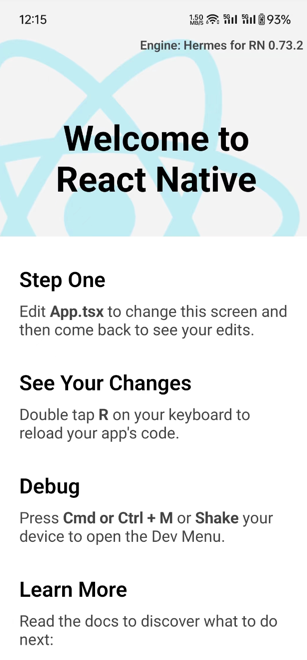

##### 项目结构分析

首先看一下整体的项目目录结构

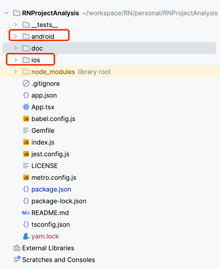

根目录实际上就是一个标准的RN项目，里面有一个`node_modules`目录，里面是项目的依赖包。
根项目目录下有一个`android`目录和一个`ios`目录，分别是Android和iOS的原生代码目录，也就是说，android和ios项目是作为RN项目的子项目存在的。

我们主要来看下android目录中的代码，这个目录下的代码是一个标准的Android项目，直接使用Android Studio打开即可。

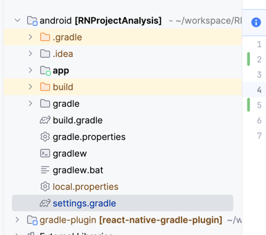

可以看到，除了一个标准的Android项目外，还有一个gradle-plugin的目录，这个目录是RN项目的gradle插件，用于编译RN代码。

下面是setting.gradle文件的内容

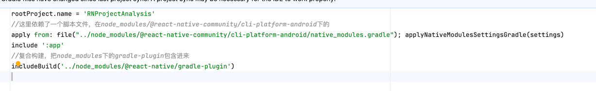
其中，应用了一个叫做 **native_modules.gradle** 的脚本

```groovy
apply from: file("../node_modules/@react-native-community/cli-platform-android/native_modules.gradle"); applyNativeModulesSettingsGradle(settings)
```

还通过includeBuild引入了一个RN插件

```groovy
includeBuild('../node_modules/@react-native/gradle-plugin')
```

再来接着看看根目录下build.gradle文件中的内容

```groovy
buildscript {
    ext {
        buildToolsVersion = "34.0.0"
        minSdkVersion = 21
        compileSdkVersion = 34
        targetSdkVersion = 34
        ndkVersion = "25.1.8937393"
        kotlinVersion = "1.8.0"
    }
    repositories {
        google()
        mavenCentral()
    }
    dependencies {
        classpath("com.android.tools.build:gradle")
        //RN插件
        classpath("com.facebook.react:react-native-gradle-plugin")
        classpath("org.jetbrains.kotlin:kotlin-gradle-plugin")
    }
}
//应用了一个叫做com.facebook.react.rootproject的插件
apply plugin: "com.facebook.react.rootproject"
```

接着看下app目录下的build.gradle文件

```groovy
apply plugin: "com.android.application"
apply plugin: "org.jetbrains.kotlin.android"
//应用了一个叫做com.facebook.react的插件
apply plugin: "com.facebook.react"

/**
 * This is the configuration block to customize your React Native Android app.
 * By default you don't need to apply any configuration, just uncomment the lines you need.
 */
react {
    /* Folders */
    //   The root of your project, i.e. where "package.json" lives. Default is '..'
    // root = file("../")
    //   The folder where the react-native NPM package is. Default is ../node_modules/react-native
    // reactNativeDir = file("../node_modules/react-native")
    //   The folder where the react-native Codegen package is. Default is ../node_modules/@react-native/codegen
    // codegenDir = file("../node_modules/@react-native/codegen")
    //   The cli.js file which is the React Native CLI entrypoint. Default is ../node_modules/react-native/cli.js
    // cliFile = file("../node_modules/react-native/cli.js")

    /* Variants */
    //   The list of variants to that are debuggable. For those we're going to
    //   skip the bundling of the JS bundle and the assets. By default is just 'debug'.
    //   If you add flavors like lite, prod, etc. you'll have to list your debuggableVariants.
    // debuggableVariants = ["liteDebug", "prodDebug"]

    /* Bundling */
    //   A list containing the node command and its flags. Default is just 'node'.
    // nodeExecutableAndArgs = ["node"]
    //
    //   The command to run when bundling. By default is 'bundle'
    // bundleCommand = "ram-bundle"
    //
    //   The path to the CLI configuration file. Default is empty.
    // bundleConfig = file(../rn-cli.config.js)
    //
    //   The name of the generated asset file containing your JS bundle
    // bundleAssetName = "MyApplication.android.bundle"
    //
    //   The entry file for bundle generation. Default is 'index.android.js' or 'index.js'
    // entryFile = file("../js/MyApplication.android.js")
    //
    //   A list of extra flags to pass to the 'bundle' commands.
    //   See https://github.com/react-native-community/cli/blob/main/docs/commands.md#bundle
    // extraPackagerArgs = []

    /* Hermes Commands */
    //   The hermes compiler command to run. By default it is 'hermesc'
    // hermesCommand = "$rootDir/my-custom-hermesc/bin/hermesc"
    //
    //   The list of flags to pass to the Hermes compiler. By default is "-O", "-output-source-map"
    // hermesFlags = ["-O", "-output-source-map"]
}

/**
 * Set this to true to Run Proguard on Release builds to minify the Java bytecode.
 */
def enableProguardInReleaseBuilds = false

/**
 * The preferred build flavor of JavaScriptCore (JSC)
 *
 * For example, to use the international variant, you can use:
 * `def jscFlavor = 'org.webkit:android-jsc-intl:+'`
 *
 * The international variant includes ICU i18n library and necessary data
 * allowing to use e.g. `Date.toLocaleString` and `String.localeCompare` that
 * give correct results when using with locales other than en-US. Note that
 * this variant is about 6MiB larger per architecture than default.
 */
def jscFlavor = 'org.webkit:android-jsc:+'

android {
    ndkVersion rootProject.ext.ndkVersion
    compileSdk rootProject.ext.compileSdkVersion

    namespace "com.yzq.rn_project_analysis"
    defaultConfig {
        applicationId "com.yzq.rn_project_analysis"
        minSdkVersion rootProject.ext.minSdkVersion
        targetSdkVersion rootProject.ext.targetSdkVersion
        versionCode 1
        versionName "1.0"
    }
    signingConfigs {
        debug {
            storeFile file('debug.keystore')
            storePassword 'android'
            keyAlias 'androiddebugkey'
            keyPassword 'android'
        }
    }
    buildTypes {
        debug {
            signingConfig signingConfigs.debug
        }
        release {
            // Caution! In production, you need to generate your own keystore file.
            // see https://reactnative.dev/docs/signed-apk-android.
            signingConfig signingConfigs.debug
            minifyEnabled enableProguardInReleaseBuilds
            proguardFiles getDefaultProguardFile("proguard-android.txt"), "proguard-rules.pro"
        }
    }
}

dependencies {
    // The version of react-native is set by the React Native Gradle Plugin
    implementation("com.facebook.react:react-android")
    implementation("com.facebook.react:flipper-integration")

    if (hermesEnabled.toBoolean()) {
        implementation("com.facebook.react:hermes-android")
    } else {
        implementation jscFlavor
    }
}
//应用了一个脚本文件
apply from: file("../../node_modules/@react-native-community/cli-platform-android/native_modules.gradle"); applyNativeModulesAppBuildGradle(project)

```

可以看到，工程的依赖配置也比较的清晰，主要是配置了一些Android的基本配置，然后引入了一些RN的插件和脚本。
至于脚本和插件里的具体内容，我们后面再来分析。

---

### 三方库使用

三方库在RN中有着非常重要的地位，因为RN本身的功能是有限的，所以需要依赖一些三方库来实现一些功能。

三方库一般提供了跨平台的支持，对前端开发同学来讲是非常友好的，不需要去了解原生的开发技术，就可以实现一些原生的功能。

三方库的使用方式非常简单，按照[使用三方库文档](https://reactnative.cn/docs/libraries)来就可以了。
下面随便去 [https://reactnative.directory/](https://reactnative.directory/) 找一个三方库来简单使用一下看看。

就以 [toast](https://github.com/arnnis/react-native-toast-notifications) 为例吧

在项目根目录下执行下面命令安装即可

```
yarn add react-native-device-info
```

安装完成后会发现，项目根目录下的package.json文件中多了一条依赖
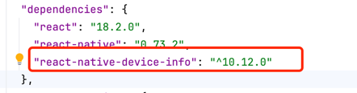

然后在项目中使用一下

```tsx
import DeviceInfo from "react-native-device-info";

<Button title={"deviceInfo"} onPress={() => {
    DeviceInfo.getAndroidId().then((id) => {
        console.log(id);
    })

}}/>

```

然后重新运行项目， 点击按钮，就可以看到控制台输出了设备的id

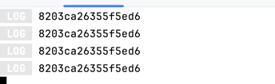

使用起来非常简单，可以看到，这里实际上完全不需要关心原生的代码，就可以实现一些原生的功能。

那作为一名native开发，下意识的就会想到，只需要一个`yarn add react-native-device-info`就能让RN项目使用原生的功能，这是怎么做到的呢？
正常来讲如果我们在原生项目中使用三方库，是需要引入三方库的jar包或者aar包的，然后在代码中调用的。
那RN肯定也逃不过这个规律，我们再来看看Android项目有什么变化

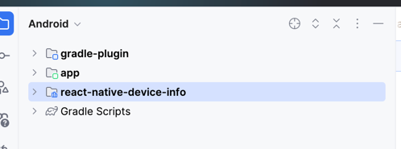

可以看到，项目中多了一个module，正是我们刚刚安装的`react-native-device-info`的代码。

这个module是怎么引入的呢？正常来讲在Android中我们想要引入一个module，需要在settings.gradle中include进来，然后在build.gradle中引入依赖。
但是，再次去看看settings.gradle和build.gradle文件，发现并没有类似的代码，那这个module是怎么引入的呢？

还记得上面在分析项目结构的时候，我们提到的一个脚本和一个插件吗？

- apply from: file("../node_modules/@react-native-community/cli-platform-android/native_modules.gradle");
- includeBuild('../node_modules/@react-native/gradle-plugin')

实际上，这两个东西就是管理RN Android项目的配置和依赖的，是非常重要的角色。

### react-native-gradle-plugin 分析

我们先来分析一下`react-native-gradle-plugin`这个插件,这个插件是RN项目的核心插件，它的作用是管理RN项目的依赖和配置。

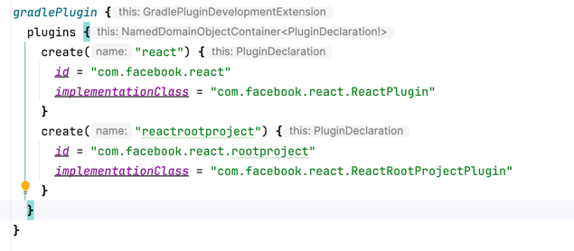

通过源码配置可以看到，一共提供了两个插件

- com.facebook.react
- com.facebook.react.rootproject

#### com.facebook.react.rootproject

我们先来看看 **com.facebook.react.rootproject**
该插件在项目的根目录下的build.gradle文件中被应用了

```groovy


/**
 * 该插件应用于`android/build.gradle`文件。
 * 该插件的作用是确保app项目在库项目之前被配置，以便在库项目被配置时可以使用app项目的配置
 *
 * @constructor
 */
class ReactRootProjectPlugin : Plugin<Project> {
    override fun apply(project: Project) {
        project.subprojects {
            // As the :app project (i.e. ReactPlugin) configures both namespaces and JVM toolchains
            // for libraries, its evaluation must happen before the libraries' evaluation.
            // Eventually the configuration of namespace/JVM toolchain can be moved inside this plugin.
            if (it.path != ":app") {
                it.evaluationDependsOn(":app")
            }
        }
    }
}

  ```

代码非常少，其作用就是是确保app项目在库项目之前被配置，以便在库项目被配置时可以使用app项目的配置。
简单说就是app中会有一个rn相关的配置，一些三方库中也会用到相关的配置，需要确保app项目的配置在库项目之前被配置以便于正常使用。

#### com.facebook.react

该插件是在app项目的build.gradle文件中被应用了
这个插件的代码相对多一些，我们来一点一点的分析

```Kotlin
    override fun apply(project: Project) {
        //检查JVM版本，不能低于17
        checkJvmVersion(project)
        //创建react配置
        val extension = project.extensions.create("react", ReactExtension::class.java, project)

        // We register a private extension on the rootProject so that project wide configs
        // like codegen config can be propagated from app project to libraries.
        /**
         * 在根项目创建一个私有的配置项 privateReact，如果已经存在则获取
         * 用于在app项目和库项目之间共享配置
         */
        val rootExtension =
            project.rootProject.extensions.findByType(PrivateReactExtension::class.java)
                ?: project.rootProject.extensions.create(
                    "privateReact", PrivateReactExtension::class.java, project
                )

        // App Only Configuration
        /**
         * 如果项目中使用了com.android.application插件，也就是app模块中会执行以下代码
         */
        project.pluginManager.withPlugin("com.android.application") {
            // We wire the root extension with the values coming from the app (either user populated or
            // defaults).

            /**
             * 下面代码实际上就是把用户自定义的配置赋值给rootExtension，就是把用户自定义的配置传递给上面创建好的一个私有配置项 privateReact
             */
            rootExtension.root.set(extension.root)
            rootExtension.reactNativeDir.set(extension.reactNativeDir)
            rootExtension.codegenDir.set(extension.codegenDir)
            rootExtension.nodeExecutableAndArgs.set(extension.nodeExecutableAndArgs)

            println("rootExtension root: ${rootExtension.root.get()}")
            println("rootExtension reactNativeDir: ${rootExtension.reactNativeDir.get()}")
            println("rootExtension codegenDir: ${rootExtension.codegenDir.get()}")
            println("rootExtension nodeExecutableAndArgs: ${rootExtension.nodeExecutableAndArgs.get()}")


            /**
             * 项目配置完成后，执行以下代码
             */
            project.afterEvaluate {
                val reactNativeDir = extension.reactNativeDir.get().asFile
                val propertiesFile = File(reactNativeDir, "ReactAndroid/gradle.properties")

                //获取版本号和groupName
                val versionAndGroupStrings = readVersionAndGroupStrings(propertiesFile)
                val versionString = versionAndGroupStrings.first
                val groupString = versionAndGroupStrings.second
                //配置依赖，主要是做了依赖替换和统一版本的逻辑
                configureDependencies(project, versionString, groupString)
                //配置仓库
                configureRepositories(project, reactNativeDir)
            }

            //配置NDK
            configureReactNativeNdk(project, extension)
            //配置App的构建配置字段
            configureBuildConfigFieldsForApp(project, extension)
            //配置开发端口 默认8081
            configureDevPorts(project)
            //处理老版本配置兼容性
            configureBackwardCompatibilityReactMap(project)
            //配置Java工具链，确保项目中的 Java 和 Kotlin 代码使用 Java 17 版本
            configureJavaToolChains(project)

            //根据不同的构建类型配置不同的任务
            project.extensions.getByType(AndroidComponentsExtension::class.java).apply {
                onVariants(selector().all()) { variant ->
                    //配置react任务，用于执行react-native的打包操作
                    project.configureReactTasks(variant = variant, config = extension)
                }
            }
            //配置react-native-codegen，用于生成所需代码
            configureCodegen(project, extension, rootExtension, isLibrary = false)
        }

        // Library Only Configuration
        configureBuildConfigFieldsForLibraries(project)
        configureNamespaceForLibraries(project)
        project.pluginManager.withPlugin("com.android.library") {
            configureCodegen(project, extension, rootExtension, isLibrary = true)
        }
    }

```

插件主要有以下逻辑

1. 检查JVM版本，不能低于17

```Kotlin
    private fun checkJvmVersion(project: Project) {
        val jvmVersion = Jvm.current()?.javaVersion?.majorVersion
        println("jvmVersion: $jvmVersion")
        if ((jvmVersion?.toIntOrNull() ?: 0) <= 16) {
            project.logger.error(
                """

      ********************************************************************************

      ERROR: requires JDK17 or higher.
      Incompatible major version detected: '$jvmVersion'

      ********************************************************************************

      """
                    .trimIndent()
            )
            exitProcess(1)
        }
    }
```

2. 创建react配置

```Kotlin
    val extension = project.extensions.create("react", ReactExtension::class.java, project)
```

3. 在根项目创建一个私有的配置项 privateReact，如果已经存在则获取，用于在app项目和库项目之间共享配置

```Kotlin
    val rootExtension =
            project.rootProject.extensions.findByType(PrivateReactExtension::class.java)
                ?: project.rootProject.extensions.create(
                    "privateReact", PrivateReactExtension::class.java, project
                )
```

PrivateReactExtension的代码如下

```Kotlin

abstract class PrivateReactExtension @Inject constructor(project: Project) {

    private val objects = project.objects

    /**
     * 创建一个根目录的属性
     * 最终的值根据项目名称决定
     * 如果项目名称为"react-native-github"或"react-native-build-from-source"，则目录为"../../"
     * 如果项目名称为其他，则目录为"../"
     */
    val root: DirectoryProperty = objects.directoryProperty().convention(
      
        if (project.rootProject.name == "react-native-github" || project.rootProject.name == "react-native-build-from-source") {
            project.rootProject.layout.projectDirectory.dir("../../")
        } else {
            project.rootProject.layout.projectDirectory.dir("../")
        }
    )

    /**
     * reactNativeDir的默认值为"node_modules/react-native"
     */
    val reactNativeDir: DirectoryProperty =
        objects.directoryProperty().convention(root.dir("node_modules/react-native"))

    /**
     * 指定 Node.js 可执行文件及其运行时参数，默认就是node，一般不会改
     */
    val nodeExecutableAndArgs: ListProperty<String> =
        objects.listProperty(String::class.java).convention(listOf("node"))

    /**
     * 生成代码的目录
     */
    val codegenDir: DirectoryProperty =
        objects.directoryProperty().convention(root.dir("node_modules/@react-native/codegen"))
}

```

4. 如果项目中使用了com.android.application插件，也就是app模块中会执行以下代码
    - 用户自定义的配置赋值给rootExtension，就是把用户自定义的配置传递给上面创建好的一个私有配置项 privateReact
    ```Kotlin
    project.pluginManager.withPlugin("com.android.application") {
        // We wire the root extension with the values coming from the app (either user populated or
        // defaults).
        rootExtension.root.set(extension.root)
        rootExtension.reactNativeDir.set(extension.reactNativeDir)
        rootExtension.codegenDir.set(extension.codegenDir)
        rootExtension.nodeExecutableAndArgs.set(extension.nodeExecutableAndArgs)
    }
    ```
    - 配置依赖，主要是做了依赖替换和统一版本的逻辑,这也就是为什么在app的build.gradle中的react
      native相关的依赖没有指定版本，实际上是在这里统一配置的

   ```Kotlin
    val reactNativeDir = extension.reactNativeDir.get().asFile
    val propertiesFile = File(reactNativeDir, "ReactAndroid/gradle.properties")

    //获取版本号和groupName
    val versionAndGroupStrings = readVersionAndGroupStrings(propertiesFile)
    val versionString = versionAndGroupStrings.first
    val groupString = versionAndGroupStrings.second
    //配置依赖，主要是做了依赖替换和统一版本的逻辑
    configureDependencies(project, versionString, groupString)
   ```
   readVersionAndGroupStrings方法，实际上就是从/node_modules/react-native/ReactAndroid/gradle.properties文件中读取版本号和group字符串
    ```Kotlin
    /**
     * 读取版本和group字符串
     * @param propertiesFile File
     * @return Pair<String, String>
     */
    fun readVersionAndGroupStrings(propertiesFile: File): Pair<String, String> {
        println("readVersionAndGroupStrings: $propertiesFile")
        val reactAndroidProperties = Properties()
        propertiesFile.inputStream().use { reactAndroidProperties.load(it) }
        val versionStringFromFile = reactAndroidProperties[INTERNAL_VERSION_NAME] as? String ?: ""
        // If on a nightly, we need to fetch the -SNAPSHOT artifact from Sonatype.
        val versionString =
            if (versionStringFromFile.startsWith("0.0.0") || "-nightly-" in versionStringFromFile) {
                "$versionStringFromFile-SNAPSHOT"
            } else {
                versionStringFromFile
            }
        // Returns Maven group for repos using different group for Maven artifacts
        val groupString =
            reactAndroidProperties[INTERNAL_PUBLISHING_GROUP] as? String
                ?: DEFAULT_INTERNAL_PUBLISHING_GROUP
        return Pair(versionString, groupString)
    }

    ```

   configureDependencies方法，主要做了依赖替换和统一版本的逻辑
    ```Kotlin
       /**
     * 配置依赖
     * 1.替换依赖
     * 2.强制使用指定版本
     *
     * @param project Project
     * @param versionString String
     * @param groupString String
     */
    fun configureDependencies(
        project: Project,
        versionString: String,
        groupString: String = DEFAULT_INTERNAL_PUBLISHING_GROUP
    ) {
        println("configureDependencies: $versionString, $groupString")
        if (versionString.isBlank()) return
        //遍历所有项目
        project.rootProject.allprojects { eachProject ->
            println("eachProject: ${eachProject.name}")
            //遍历项目的所有配置
            eachProject.configurations.all { configuration ->
                /**
                 * configuration.resolutionStrategy 用于配置解析策略，一般用于配置依赖替换和强制使用指定版本
                 */
                configuration.resolutionStrategy.dependencySubstitution {
                    //获取依赖替换列表
                    getDependencySubstitutions(
                        versionString,
                        groupString
                    ).forEach { (module, dest, reason) ->
                        //将指定的依赖替换为目标依赖
                        it.substitute(it.module(module)).using(it.module(dest)).because(reason)
                    }
                }
                //强制使用指定版本
                configuration.resolutionStrategy.force(
                    "${groupString}:react-android:${versionString}",
                    "${groupString}:flipper-integration:${versionString}",
                )

                //如果用户没有选择使用夜间版本进行本地开发，则强制使用hermes-android指定版本
                if (!(eachProject.findProperty(INTERNAL_USE_HERMES_NIGHTLY) as? String).toBoolean()) {
                    // Contributors only: The hermes-engine version is forced only if the user has
                    // not opted into using nightlies for local development.
                    configuration.resolutionStrategy.force("${groupString}:hermes-android:${versionString}")
                }
            }
        }
    }

    ```
   getDependencySubstitutions方法，主要是生成需要进行依赖替换的列表
    ```Kotlin
    /**
     * 生成依赖替换列表
     * @param versionString String
     * @param groupString String
     * @return List<Triple<String, String, String>>
     */
    internal fun getDependencySubstitutions(
        versionString: String,
        groupString: String = DEFAULT_INTERNAL_PUBLISHING_GROUP
    ): List<Triple<String, String, String>> {
        /**
         * 生成依赖替换列表
         * first:原始依赖
         * second:替换后的依赖
         * third:原因
         */
        val dependencySubstitution = mutableListOf<Triple<String, String, String>>()
        // react-native替换为react-android
        dependencySubstitution.add(
            Triple(
                "com.facebook.react:react-native",
                "${groupString}:react-android:${versionString}",
                "The react-native artifact was deprecated in favor of react-android due to https://github.com/facebook/react-native/issues/35210."
            )
        )
        // hermes-engine替换为hermes-android
        dependencySubstitution.add(
            Triple(
                "com.facebook.react:hermes-engine",
                "${groupString}:hermes-android:${versionString}",
                "The hermes-engine artifact was deprecated in favor of hermes-android due to https://github.com/facebook/react-native/issues/35210."
            )
        )
        // 如果 groupString 不是默认值 com.facebook.react，则修改react-android和hermes-android的Maven group
        if (groupString != DEFAULT_INTERNAL_PUBLISHING_GROUP) {
            dependencySubstitution.add(
                Triple(
                    "com.facebook.react:react-android",
                    "${groupString}:react-android:${versionString}",
                    "The react-android dependency was modified to use the correct Maven group."
                )
            )
            dependencySubstitution.add(
                Triple(
                    "com.facebook.react:hermes-android",
                    "${groupString}:hermes-android:${versionString}",
                    "The hermes-android dependency was modified to use the correct Maven group."
                )
            )
        }

        return dependencySubstitution
    }

    ```
    - 配置仓库源，这个比较简单，就是配置了一些依赖所需的仓库地址
    ```Kotlin
       fun configureRepositories(project: Project, reactNativeDir: File) {
        println("configureRepositories: $reactNativeDir")
        project.rootProject.allprojects { eachProject ->
            with(eachProject) {
                if (hasProperty(INTERNAL_REACT_NATIVE_MAVEN_LOCAL_REPO)) {
                    val mavenLocalRepoPath =
                        property(INTERNAL_REACT_NATIVE_MAVEN_LOCAL_REPO) as String
                    mavenRepoFromURI(File(mavenLocalRepoPath).toURI())
                }
                // We add the snapshot for users on nightlies.
                mavenRepoFromUrl("https://oss.sonatype.org/content/repositories/snapshots/")
                repositories.mavenCentral { repo ->
                    // We don't want to fetch JSC from Maven Central as there are older versions there.
                    repo.content { it.excludeModule("org.webkit", "android-jsc") }
                }
                // Android JSC is installed from npm
                mavenRepoFromURI(File(reactNativeDir, "../jsc-android/dist").toURI())
                repositories.google()
                mavenRepoFromUrl("https://www.jitpack.io")
            }
        }
    }
    ```
    - 配置NDK（Native Development Kit）相关设置
   ```Kotlin
    fun configureReactNativeNdk(project: Project, extension: ReactExtension) {
        project.pluginManager.withPlugin("com.android.application") {
            project.extensions.getByType(AndroidComponentsExtension::class.java)
                .finalizeDsl { ext ->
                    //是否启用新架构 没有直接返回
                    if (!project.isNewArchEnabled(extension)) {
                        // For Old Arch, we don't need to setup the NDK
                        return@finalizeDsl
                    }
                    // We enable prefab so users can consume .so/headers from ReactAndroid and hermes-engine
                    // .aar
                    ext.buildFeatures.prefab = true

                    // If the user has not provided a CmakeLists.txt path, let's provide
                    // the default one from the framework
                    if (ext.externalNativeBuild.cmake.path == null) {
                        ext.externalNativeBuild.cmake.path = File(
                            extension.reactNativeDir.get().asFile,
                            "ReactAndroid/cmake-utils/default-app-setup/CMakeLists.txt"
                        )
                    }

                    // Parameters should be provided in an additive manner (do not override what
                    // the user provided, but allow for sensible defaults).
                    val cmakeArgs = ext.defaultConfig.externalNativeBuild.cmake.arguments
                    if (cmakeArgs.none { it.startsWith("-DPROJECT_BUILD_DIR") }) {
                        cmakeArgs.add("-DPROJECT_BUILD_DIR=${project.layout.buildDirectory.get().asFile}")
                    }
                    if (cmakeArgs.none { it.startsWith("-DREACT_ANDROID_DIR") }) {
                        cmakeArgs.add(
                            "-DREACT_ANDROID_DIR=${
                                extension.reactNativeDir.file("ReactAndroid").get().asFile
                            }"
                        )
                    }
                    if (cmakeArgs.none { it.startsWith("-DANDROID_STL") }) {
                        cmakeArgs.add("-DANDROID_STL=c++_shared")
                    }
                    // Due to the new NDK toolchain file, the C++ flags gets overridden between compilation
                    // units. This is causing some libraries to don't be compiled with -DANDROID and other
                    // crucial flags. This can be revisited once we bump to NDK 25/26
                    if (cmakeArgs.none { it.startsWith("-DANDROID_USE_LEGACY_TOOLCHAIN_FILE") }) {
                        cmakeArgs.add("-DANDROID_USE_LEGACY_TOOLCHAIN_FILE=ON")
                    }

                    val architectures = project.getReactNativeArchitectures()
                    // abiFilters are split ABI are not compatible each other, so we set the abiFilters
                    // only if the user hasn't enabled the split abi feature.
                    if (architectures.isNotEmpty() && !ext.splits.abi.isEnable) {
                        ext.defaultConfig.ndk.abiFilters.addAll(architectures)
                    }
                }
        }
    }

   
   ```
    - 配置App的构建配置字段
    ```Kotlin
       /**
     * 确保在 Android 应用或库项目中启用buildConfig，并添加了两个自定义的布尔类型的构建配置字段，用于表示新架构是否启用以及是否启用了 Hermes 引擎。
     * 这些字段将在生成的 BuildConfig 类中作为静态字段提供。
     * @param project Project
     * @param extension ReactExtension
     */
    fun configureBuildConfigFieldsForApp(project: Project, extension: ReactExtension) {
        val action =
            Action<AppliedPlugin> {
                project.extensions.getByType(AndroidComponentsExtension::class.java)
                    .finalizeDsl { ext ->
                        ext.buildFeatures.buildConfig = true
                        ext.defaultConfig.buildConfigField(
                            "boolean",
                            "IS_NEW_ARCHITECTURE_ENABLED",
                            project.isNewArchEnabled(extension).toString()
                        )
                        ext.defaultConfig.buildConfigField(
                            "boolean", "IS_HERMES_ENABLED", project.isHermesEnabled.toString()
                        )
                    }
            }
        project.pluginManager.withPlugin("com.android.application", action)
        project.pluginManager.withPlugin("com.android.library", action)
    }

   ```
    - 配置开发端口 默认8081
   ```Kotlin
       fun configureDevPorts(project: Project) {
        val devServerPort =
            project.properties["reactNativeDevServerPort"]?.toString() ?: DEFAULT_DEV_SERVER_PORT
        val inspectorProxyPort =
            project.properties["reactNativeInspectorProxyPort"]?.toString() ?: devServerPort

        val action =
            Action<AppliedPlugin> {
                project.extensions.getByType(AndroidComponentsExtension::class.java)
                    .finalizeDsl { ext ->
                        ext.defaultConfig.resValue(
                            "integer",
                            "react_native_dev_server_port",
                            devServerPort
                        )
                        ext.defaultConfig.resValue(
                            "integer", "react_native_inspector_proxy_port", inspectorProxyPort
                        )
                    }
            }

        project.pluginManager.withPlugin("com.android.application", action)
        project.pluginManager.withPlugin("com.android.library", action)
    }

   
   ```

    - 处理老版本配置兼容性
    ```Kotlin
     fun configureBackwardCompatibilityReactMap(project: Project) {
    if (project.extensions.extraProperties.has("react")) {
      @Suppress("UNCHECKED_CAST")
      val reactMap =
          project.extensions.extraProperties.get("react") as? Map<String, Any?> ?: mapOf()
      if (reactMap.isNotEmpty()) {
        project.logger.error(
            """
          ********************************************************************************
 
          ERROR: Using old project.ext.react configuration. 
          We identified that your project is using a old configuration block as:
          
          project.ext.react = [
              // ...
          ]
          
          You should migrate to the new configuration:
          
          react {
              // ...
          }
          You can find documentation inside `android/app/build.gradle` on how to use it.
        
          ********************************************************************************
          """
                .trimIndent())
      }
    }

    // We set an empty react[] map so if a library is reading it, they will find empty values.
    project.extensions.extraProperties.set("react", mapOf<String, String>())
    }
   ```

    - 配置Java工具链，确保项目中的 Java 和 Kotlin 代码使用 Java 17 版本
    ```Kotlin
    fun configureJavaToolChains(input: Project) {
        // Check at the app level if react.internal.disableJavaVersionAlignment is set.
        if (input.hasProperty(INTERNAL_DISABLE_JAVA_VERSION_ALIGNMENT)) {
            return
        }
        input.rootProject.allprojects { project ->
            // Allows every single module to set react.internal.disableJavaVersionAlignment also.
            if (project.hasProperty(INTERNAL_DISABLE_JAVA_VERSION_ALIGNMENT)) {
                return@allprojects
            }
            val action =
                Action<AppliedPlugin> {
                    project.extensions.getByType(AndroidComponentsExtension::class.java)
                        .finalizeDsl { ext
                            ->
                            ext.compileOptions.sourceCompatibility = JavaVersion.VERSION_17
                            ext.compileOptions.targetCompatibility = JavaVersion.VERSION_17
                        }
                }
            project.pluginManager.withPlugin("com.android.application", action)
            project.pluginManager.withPlugin("com.android.library", action)
            project.pluginManager.withPlugin("org.jetbrains.kotlin.android") {
                project.extensions.getByType(KotlinTopLevelExtension::class.java).jvmToolchain(17)
            }
            project.pluginManager.withPlugin("org.jetbrains.kotlin.jvm") {
                project.extensions.getByType(KotlinTopLevelExtension::class.java).jvmToolchain(17)
            }
        }
    }
    ```
    - 根据不同的构建类型配置不同的任务
    ```Kotlin
            //根据不同的构建类型配置不同的任务
            project.extensions.getByType(AndroidComponentsExtension::class.java).apply {
                onVariants(selector().all()) { variant ->
                    //配置react任务，用于执行react-native的打包操作
                    project.configureReactTasks(variant = variant, config = extension)
                }
            }
    ``` 
   configureReactTasks 扩展方法
    ```Kotlin
   internal fun Project.configureReactTasks(variant: Variant, config: ReactExtension) {
    val targetName = variant.name.capitalizeCompat()
    val targetPath = variant.name

    val buildDir = this.layout.buildDirectory.get().asFile
    // Resources: generated/assets/react/<variant>/index.android.bundle
    val resourcesDir = File(buildDir, "generated/res/react/$targetPath")
    // Bundle: generated/assets/react/<variant>/index.android.bundle
    val jsBundleDir = File(buildDir, "generated/assets/react/$targetPath")
    // Sourcemap: generated/sourcemaps/react/<variant>/index.android.bundle.map
    val jsSourceMapsDir = File(buildDir, "generated/sourcemaps/react/$targetPath")
    // Intermediate packager:
    // intermediates/sourcemaps/react/<variant>/index.android.bundle.packager.map
    // Intermediate compiler:
    // intermediates/sourcemaps/react/<variant>/index.android.bundle.compiler.map
    val jsIntermediateSourceMapsDir = File(buildDir, "intermediates/sourcemaps/react/$targetPath")

    // The location of the cli.js file for React Native
    val cliFile = detectedCliFile(config)

    val isHermesEnabledInProject = project.isHermesEnabled
    val isHermesEnabledInThisVariant =
        if (config.enableHermesOnlyInVariants.get().isNotEmpty()) {
            config.enableHermesOnlyInVariants.get()
                .contains(variant.name) && isHermesEnabledInProject
        } else {
            isHermesEnabledInProject
        }
    val isDebuggableVariant =
        config.debuggableVariants.get().any { it.equals(variant.name, ignoreCase = true) }

    //配置新架构打包选项
    configureNewArchPackagingOptions(project, config, variant)
    //配置JS引擎打包选项
    configureJsEnginePackagingOptions(config, variant, isHermesEnabledInThisVariant)

    if (!isDebuggableVariant) {
        val entryFileEnvVariable = System.getenv("ENTRY_FILE")
        val bundleTask =
            tasks.register("createBundle${targetName}JsAndAssets", BundleHermesCTask::class.java) {
                it.root.set(config.root)
                it.nodeExecutableAndArgs.set(config.nodeExecutableAndArgs)
                it.cliFile.set(cliFile)
                it.bundleCommand.set(config.bundleCommand)
                it.entryFile.set(detectedEntryFile(config, entryFileEnvVariable))
                it.extraPackagerArgs.set(config.extraPackagerArgs)
                it.bundleConfig.set(config.bundleConfig)
                it.bundleAssetName.set(config.bundleAssetName)
                it.jsBundleDir.set(jsBundleDir)
                it.resourcesDir.set(resourcesDir)
                it.hermesEnabled.set(isHermesEnabledInThisVariant)
                it.minifyEnabled.set(!isHermesEnabledInThisVariant)
                it.devEnabled.set(false)
                it.jsIntermediateSourceMapsDir.set(jsIntermediateSourceMapsDir)
                it.jsSourceMapsDir.set(jsSourceMapsDir)
                it.hermesCommand.set(config.hermesCommand)
                it.hermesFlags.set(config.hermesFlags)
                it.reactNativeDir.set(config.reactNativeDir)
            }
        //将生成的资源目录添加到源集
        variant.sources.res?.addGeneratedSourceDirectory(
            bundleTask,
            BundleHermesCTask::resourcesDir
        )
        variant.sources.assets?.addGeneratedSourceDirectory(
            bundleTask,
            BundleHermesCTask::jsBundleDir
        )
        }
    }
    ```

    - 配置react-native-codegen，用于生成所需代码，帮助我们避免编写重复代码的工具。
5. 配置library项目的构建配置字段

```Kotlin
    /**
     * 配置构建配置字段
     * @param appProject Project
     */
    fun configureBuildConfigFieldsForLibraries(appProject: Project) {
        appProject.rootProject.allprojects { subproject ->
            subproject.pluginManager.withPlugin("com.android.library") {
                subproject.extensions.getByType(AndroidComponentsExtension::class.java)
                    .finalizeDsl { ext ->
                        ext.buildFeatures.buildConfig = true
                    }
            }
        }
    }

```

6. 配置library项目的namespace

```Kotlin
    fun configureNamespaceForLibraries(appProject: Project) {
        appProject.rootProject.allprojects { subproject ->
            subproject.pluginManager.withPlugin("com.android.library") {
                subproject.extensions.getByType(AndroidComponentsExtension::class.java)
                    .finalizeDsl { ext ->
                        if (ext.namespace == null) {
                            val android =
                                subproject.extensions.getByType(LibraryExtension::class.java)
                            val manifestFile = android.sourceSets.getByName("main").manifest.srcFile

                            manifestFile
                                .takeIf { it.exists() }
                                ?.let { file ->
                                    getPackageNameFromManifest(file)?.let { packageName ->
                                        ext.namespace = packageName
                                    }
                                }
                        }
                    }
            }
        }
    }
```

7. 如果项目中使用了com.android.library插件，也就是library模块中会执行以下代码
    - 配置react-native-codegen，用于生成所需代码，帮助我们避免编写重复代码的工具。

**总结**

到这里，我们大致清楚了`react-native-gradle-plugin`这个插件的主要作用如下

- 做了一些编译环境的检查
- 创建了一些配置项，用于在app项目和库项目之间共享配置
- 统一替换项目中的react-native相关的依赖，并确保版本一致
- 配置任务，包括打包，生成代码等

---

### native_modules.gradle 分析

下面再来看下`native_modules.gradle`这个脚本文件。这是一个源码形式的脚本文件，虽然只有一个文件，但是实际上要比插件的逻辑还要复杂一些，
源码如下

```groovy
import groovy.json.JsonSlurper
import org.gradle.initialization.DefaultSettings
import org.apache.tools.ant.taskdefs.condition.Os

def generatedFileName = "PackageList.java"
def generatedFilePackage = "com.facebook.react"
def generatedFileContentsTemplate = """
package $generatedFilePackage;

import android.app.Application;
import android.content.Context;
import android.content.res.Resources;

import com.facebook.react.ReactPackage;
import com.facebook.react.shell.MainPackageConfig;
import com.facebook.react.shell.MainReactPackage;
import java.util.Arrays;
import java.util.ArrayList;

{{ packageImports }}

public class PackageList {
  private Application application;
  private ReactNativeHost reactNativeHost;
  private MainPackageConfig mConfig;

  public PackageList(ReactNativeHost reactNativeHost) {
    this(reactNativeHost, null);
  }

  public PackageList(Application application) {
    this(application, null);
  }

  public PackageList(ReactNativeHost reactNativeHost, MainPackageConfig config) {
    this.reactNativeHost = reactNativeHost;
    mConfig = config;
  }

  public PackageList(Application application, MainPackageConfig config) {
    this.reactNativeHost = null;
    this.application = application;
    mConfig = config;
  }

  private ReactNativeHost getReactNativeHost() {
    return this.reactNativeHost;
  }

  private Resources getResources() {
    return this.getApplication().getResources();
  }

  private Application getApplication() {
    if (this.reactNativeHost == null) return this.application;
    return this.reactNativeHost.getApplication();
  }

  private Context getApplicationContext() {
    return this.getApplication().getApplicationContext();
  }

  public ArrayList<ReactPackage> getPackages() {
    return new ArrayList<>(Arrays.<ReactPackage>asList(
      new MainReactPackage(mConfig){{ packageClassInstances }}
    ));
  }
}
"""

def cmakeTemplate = """# This code was generated by [React Native CLI](https://www.npmjs.com/package/@react-native-community/cli)

cmake_minimum_required(VERSION 3.13)
set(CMAKE_VERBOSE_MAKEFILE on)

{{ libraryIncludes }}

set(AUTOLINKED_LIBRARIES
  {{ libraryModules }}
)
"""

def rncliCppTemplate = """/**
 * This code was generated by [React Native CLI](https://www.npmjs.com/package/@react-native-community/cli).
 *
 * Do not edit this file as changes may cause incorrect behavior and will be lost
 * once the code is regenerated.
 *
 */

#include "rncli.h"
{{ rncliCppIncludes }}

namespace facebook {
namespace react {

{{ rncliReactLegacyComponentNames }}

std::shared_ptr<TurboModule> rncli_ModuleProvider(const std::string moduleName, const JavaTurboModule::InitParams &params) {
{{ rncliCppModuleProviders }}
  return nullptr;
}

void rncli_registerProviders(std::shared_ptr<ComponentDescriptorProviderRegistry const> providerRegistry) {
{{ rncliCppComponentDescriptors }}
{{ rncliReactLegacyComponentDescriptors }}
  return;
}

} // namespace react
} // namespace facebook
"""

def rncliHTemplate = """/**
 * This code was generated by [React Native CLI](https://www.npmjs.com/package/@react-native-community/cli).
 *
 * Do not edit this file as changes may cause incorrect behavior and will be lost
 * once the code is regenerated.
 *
 */

#pragma once

#include <ReactCommon/JavaTurboModule.h>
#include <ReactCommon/TurboModule.h>
#include <jsi/jsi.h>
#include <react/renderer/componentregistry/ComponentDescriptorProviderRegistry.h>

namespace facebook {
namespace react {

std::shared_ptr<TurboModule> rncli_ModuleProvider(const std::string moduleName, const JavaTurboModule::InitParams &params);
void rncli_registerProviders(std::shared_ptr<ComponentDescriptorProviderRegistry const> providerRegistry);

} // namespace react
} // namespace facebook
"""

class ReactNativeModules {
  private Logger logger
  private String packageName
  private File root
  private ArrayList<HashMap<String, String>> reactNativeModules
  private ArrayList<String> unstable_reactLegacyComponentNames
  private HashMap<String, ArrayList> reactNativeModulesBuildVariants
  private String reactNativeVersion

  private static String LOG_PREFIX = ":ReactNative:"

  ReactNativeModules(Logger logger, File root) {
    this.logger = logger
    this.root = root

    def (nativeModules, reactNativeModulesBuildVariants, androidProject, reactNativeVersion) = this.getReactNativeConfig()
    this.reactNativeModules = nativeModules
    this.reactNativeModulesBuildVariants = reactNativeModulesBuildVariants
    this.packageName = androidProject["packageName"]
    this.unstable_reactLegacyComponentNames = androidProject["unstable_reactLegacyComponentNames"]
    this.reactNativeVersion = reactNativeVersion
  }

  /**
   * Include the react native modules android projects and specify their project directory
   */
  void addReactNativeModuleProjects(DefaultSettings defaultSettings) {
    reactNativeModules.forEach { reactNativeModule ->
      String nameCleansed = reactNativeModule["nameCleansed"]
      String androidSourceDir = reactNativeModule["androidSourceDir"]
      defaultSettings.include(":${nameCleansed}")
      defaultSettings.project(":${nameCleansed}").projectDir = new File("${androidSourceDir}")
    }
  }

  /**
   * Adds the react native modules as dependencies to the users `app` project
   */
  void addReactNativeModuleDependencies(Project appProject) {
    reactNativeModules.forEach { reactNativeModule ->
      def nameCleansed = reactNativeModule["nameCleansed"]
      def dependencyConfiguration = reactNativeModule["dependencyConfiguration"]
      appProject.dependencies {
        if (reactNativeModulesBuildVariants.containsKey(nameCleansed)) {
          reactNativeModulesBuildVariants
            .get(nameCleansed)
            .forEach { buildVariant ->
              if(dependencyConfiguration != null) {
                "${buildVariant}${dependencyConfiguration}"
              } else {
                "${buildVariant}Implementation" project(path: ":${nameCleansed}")
              }
            }
        } else {
          if(dependencyConfiguration != null) {
            "${dependencyConfiguration}"
          } else {
             implementation project(path: ":${nameCleansed}")
          }
        }
      }
    }
  }

  /**
   * Code-gen a java file with all the detected ReactNativePackage instances automatically added
   *
   * @param outputDir
   * @param generatedFileName
   * @param generatedFileContentsTemplate
   */
  void generatePackagesFile(File outputDir, String generatedFileName, String generatedFileContentsTemplate) {
    ArrayList<HashMap<String, String>> packages = this.reactNativeModules
    String packageName = this.packageName

    String packageImports = ""
    String packageClassInstances = ""

    if (packages.size() > 0) {
      def interpolateDynamicValues = {
        it
                // Before adding the package replacement mechanism,
                // BuildConfig and R classes were imported automatically
                // into the scope of the file. We want to replace all
                // non-FQDN references to those classes with the package name
                // of the MainApplication.
                //
                // We want to match "R" or "BuildConfig":
                //  - new Package(R.string…),
                //  - Module.configure(BuildConfig);
                //    ^ hence including (BuildConfig|R)
                // but we don't want to match "R":
                //  - new Package(getResources…),
                //  - new PackageR…,
                //  - new Royal…,
                //    ^ hence excluding \w before and after matches
                // and "BuildConfig" that has FQDN reference:
                //  - Module.configure(com.acme.BuildConfig);
                //    ^ hence excluding . before the match.
                .replaceAll(~/([^.\w])(BuildConfig|R)([^\w])/, {
                  wholeString, prefix, className, suffix ->
                    "${prefix}${packageName}.${className}${suffix}"
                })
      }
      packageImports = packages.collect {
        "// ${it.name}\n${interpolateDynamicValues(it.packageImportPath)}"
      }.join('\n')
      packageClassInstances = ",\n      " + packages.collect {
        interpolateDynamicValues(it.packageInstance)
      }.join(",\n      ")
    }

    String generatedFileContents = generatedFileContentsTemplate
      .replace("{{ packageImports }}", packageImports)
      .replace("{{ packageClassInstances }}", packageClassInstances)

    outputDir.mkdirs()
    final FileTreeBuilder treeBuilder = new FileTreeBuilder(outputDir)
    treeBuilder.file(generatedFileName).newWriter().withWriter { w ->
      w << generatedFileContents
    }
  }

  void generateCmakeFile(File outputDir, String generatedFileName, String generatedFileContentsTemplate) {
    ArrayList<HashMap<String, String>> packages = this.reactNativeModules
    String packageName = this.packageName
    String codegenLibPrefix = "react_codegen_"
    String libraryIncludes = ""
    String libraryModules = ""

    if (packages.size() > 0) {
      libraryIncludes = packages.collect {
        if (it.libraryName != null && it.cmakeListsPath != null) {
          // If user provided a custom cmakeListsPath, let's honor it.
          String nativeFolderPath = it.cmakeListsPath.replace("CMakeLists.txt", "")
          "add_subdirectory($nativeFolderPath ${it.libraryName}_autolinked_build)"
        } else {
          null
        }
      }.minus(null).join('\n')
      libraryModules = packages.collect {
        it.libraryName ? "${codegenLibPrefix}${it.libraryName}" : null
      }.minus(null).join('\n  ')
    }

    String generatedFileContents = generatedFileContentsTemplate
      .replace("{{ libraryIncludes }}", libraryIncludes)
      .replace("{{ libraryModules }}", libraryModules)

    outputDir.mkdirs()
    final FileTreeBuilder treeBuilder = new FileTreeBuilder(outputDir)
    treeBuilder.file(generatedFileName).newWriter().withWriter { w ->
      w << generatedFileContents
    }
  }

  void generateRncliCpp(File outputDir, String generatedFileName, String generatedFileContentsTemplate) {
    ArrayList<HashMap<String, String>> packages = this.reactNativeModules
    ArrayList<String> unstable_reactLegacyComponentNames = this.unstable_reactLegacyComponentNames
    String rncliCppIncludes = ""
    String rncliCppModuleProviders = ""
    String rncliCppComponentDescriptors = ""
    String rncliReactLegacyComponentDescriptors = ""
    String rncliReactLegacyComponentNames = ""
    String codegenComponentDescriptorsHeaderFile = "ComponentDescriptors.h"
    String codegenReactComponentsDir = "react/renderer/components"

    if (packages.size() > 0) {
      rncliCppIncludes = packages.collect {
        if (!it.libraryName) {
          return null
        }
        def result = "#include <${it.libraryName}.h>"
        if (it.componentDescriptors && it.componentDescriptors.size() > 0) {
          result += "\n#include <${codegenReactComponentsDir}/${it.libraryName}/${codegenComponentDescriptorsHeaderFile}>"
        }
        result
      }.minus(null).join('\n')
      rncliCppModuleProviders = packages.collect {
        it.libraryName ? """  auto module_${it.libraryName} = ${it.libraryName}_ModuleProvider(moduleName, params);
  if (module_${it.libraryName} != nullptr) {
    return module_${it.libraryName};
  }""" : null
      }.minus(null).join("\n")
      rncliCppComponentDescriptors = packages.collect {
        def result = ""
        if (it.componentDescriptors && it.componentDescriptors.size() > 0) {
          result += it.componentDescriptors.collect {
            "  providerRegistry->add(concreteComponentDescriptorProvider<${it}>());"
          }.join('\n')
        }
        result
      }.join("\n")
    }

    rncliReactLegacyComponentDescriptors = unstable_reactLegacyComponentNames.collect {
      "  providerRegistry->add(concreteComponentDescriptorProvider<UnstableLegacyViewManagerInteropComponentDescriptor<${it}>>());"
    }.join("\n")
    rncliReactLegacyComponentNames = unstable_reactLegacyComponentNames.collect {
      "extern const char ${it}[] = \"${it}\";"
    }.join("\n")
    if (unstable_reactLegacyComponentNames && unstable_reactLegacyComponentNames.size() > 0) {
      rncliCppIncludes += "\n#include <react/renderer/components/legacyviewmanagerinterop/UnstableLegacyViewManagerInteropComponentDescriptor.h>"
    }

    String generatedFileContents = generatedFileContentsTemplate
      .replace("{{ rncliCppIncludes }}", rncliCppIncludes)
      .replace("{{ rncliCppModuleProviders }}", rncliCppModuleProviders)
      .replace("{{ rncliCppComponentDescriptors }}", rncliCppComponentDescriptors)
      .replace("{{ rncliReactLegacyComponentDescriptors }}", rncliReactLegacyComponentDescriptors)
      .replace("{{ rncliReactLegacyComponentNames }}", rncliReactLegacyComponentNames)

    outputDir.mkdirs()
    final FileTreeBuilder treeBuilder = new FileTreeBuilder(outputDir)
    treeBuilder.file(generatedFileName).newWriter().withWriter { w ->
      w << generatedFileContents
    }
  }

  void generateRncliH(File outputDir, String generatedFileName, String generatedFileContentsTemplate) {
    String generatedFileContents = generatedFileContentsTemplate

    outputDir.mkdirs()
    final FileTreeBuilder treeBuilder = new FileTreeBuilder(outputDir)
    treeBuilder.file(generatedFileName).newWriter().withWriter { w ->
      w << generatedFileContents
    }
  }

  /**
   * Runs a specified command using Runtime exec() in a specified directory.
   * Throws when the command result is empty.
   */
  String getCommandOutput(String[] command, File directory) {
    try {
      def output = ""
      def cmdProcess = Runtime.getRuntime().exec(command, null, directory)
      def bufferedReader = new BufferedReader(new InputStreamReader(cmdProcess.getInputStream()))
      def buff = ""
      def readBuffer = new StringBuffer()
      while ((buff = bufferedReader.readLine()) != null) {
        readBuffer.append(buff)
      }
      output = readBuffer.toString()
      if (!output) {
        this.logger.error("${LOG_PREFIX}Unexpected empty result of running '${command}' command.")
        def bufferedErrorReader = new BufferedReader(new InputStreamReader(cmdProcess.getErrorStream()))
        def errBuff = ""
        def readErrorBuffer = new StringBuffer()
        while ((errBuff = bufferedErrorReader.readLine()) != null) {
          readErrorBuffer.append(errBuff)
        }
        throw new Exception(readErrorBuffer.toString())
      }
      return output
    } catch (Exception exception) {
      this.logger.error("${LOG_PREFIX}Running '${command}' command failed.")
      throw exception
    }
  }

  /**
   * Runs a process to call the React Native CLI Config command and parses the output
   */
  ArrayList<HashMap<String, String>> getReactNativeConfig() {
    if (this.reactNativeModules != null) return this.reactNativeModules

    ArrayList<HashMap<String, String>> reactNativeModules = new ArrayList<HashMap<String, String>>()
    HashMap<String, ArrayList> reactNativeModulesBuildVariants = new HashMap<String, ArrayList>()

    /**
     * Resolve the CLI location from Gradle file
     *
     * @todo: Sometimes Gradle can be called outside of the JavaScript hierarchy (-p flag) which
     * will fail to resolve the script and the dependencies. We should resolve this soon.
     *
     * @todo: `fastlane` has been reported to not work too.
     */
    def cliResolveScript = "try {console.log(require('@react-native-community/cli').bin);} catch (e) {console.log(require('react-native/cli').bin);}"
    String[] nodeCommand = ["node", "-e", cliResolveScript]
    def cliPath = this.getCommandOutput(nodeCommand, this.root)

    String[] reactNativeConfigCommand = ["node", cliPath, "config"]
    def reactNativeConfigOutput = this.getCommandOutput(reactNativeConfigCommand, this.root)

    def json
    try {
      json = new JsonSlurper().parseText(reactNativeConfigOutput)
    } catch (Exception exception) {
      throw new Exception("Calling `${reactNativeConfigCommand}` finished with an exception. Error message: ${exception.toString()}. Output: ${reactNativeConfigOutput}");
    }
    def dependencies = json["dependencies"]
    def project = json["project"]["android"]
    def reactNativeVersion = json["version"]

    if (project == null) {
      throw new Exception("React Native CLI failed to determine Android project configuration. This is likely due to misconfiguration. Config output:\n${json.toMapString()}")
    }

    def engine = new groovy.text.SimpleTemplateEngine()

    dependencies.each { name, value ->
      def platformsConfig = value["platforms"];
      def androidConfig = platformsConfig["android"]

      if (androidConfig != null && androidConfig["sourceDir"] != null) {
        this.logger.info("${LOG_PREFIX}Automatically adding native module '${name}'")

        HashMap reactNativeModuleConfig = new HashMap<String, String>()
        def nameCleansed = name.replaceAll('[~*!\'()]+', '_').replaceAll('^@([\\w-.]+)/', '$1_')
        reactNativeModuleConfig.put("name", name)
        reactNativeModuleConfig.put("nameCleansed", nameCleansed)
        reactNativeModuleConfig.put("androidSourceDir", androidConfig["sourceDir"])
        reactNativeModuleConfig.put("packageInstance", androidConfig["packageInstance"])
        reactNativeModuleConfig.put("packageImportPath", androidConfig["packageImportPath"])
        reactNativeModuleConfig.put("libraryName", androidConfig["libraryName"])
        reactNativeModuleConfig.put("componentDescriptors", androidConfig["componentDescriptors"])
        reactNativeModuleConfig.put("cmakeListsPath", androidConfig["cmakeListsPath"])

        if (androidConfig["buildTypes"] && !androidConfig["buildTypes"].isEmpty()) {
          reactNativeModulesBuildVariants.put(nameCleansed, androidConfig["buildTypes"])
        }
        if(androidConfig.containsKey("dependencyConfiguration")) {
          reactNativeModuleConfig.put("dependencyConfiguration", androidConfig["dependencyConfiguration"])
        } else if (project.containsKey("dependencyConfiguration")) {
          def bindings = ["dependencyName": nameCleansed]
          def template = engine.createTemplate(project["dependencyConfiguration"]).make(bindings)

          reactNativeModuleConfig.put("dependencyConfiguration", template.toString())
        }

        this.logger.trace("${LOG_PREFIX}'${name}': ${reactNativeModuleConfig.toMapString()}")

        reactNativeModules.add(reactNativeModuleConfig)
      } else {
        this.logger.info("${LOG_PREFIX}Skipping native module '${name}'")
      }
    }

    return [reactNativeModules, reactNativeModulesBuildVariants, json["project"]["android"], reactNativeVersion];
  }
}


/*
 * Sometimes Gradle can be called outside of JavaScript hierarchy. Detect the directory
 * where build files of an active project are located.
 */
def projectRoot = rootProject.projectDir

def autoModules = new ReactNativeModules(logger, projectRoot)

def reactNativeVersionRequireNewArchEnabled(autoModules) {
    def rnVersion = autoModules.reactNativeVersion
    def regexPattern = /^(\d+)\.(\d+)\.(\d+)(?:-(\w+(?:[-.]\d+)?))?$/

    if (rnVersion =~ regexPattern) {
        def result = (rnVersion =~ regexPattern).findAll().first()

        def major = result[1].toInteger()
        if (major > 0 && major < 1000) {
            return true
        }
    }
    return false
}

/** -----------------------
 *    Exported Extensions
 * ------------------------ */

ext.applyNativeModulesSettingsGradle = { DefaultSettings defaultSettings ->
  autoModules.addReactNativeModuleProjects(defaultSettings)
}

ext.applyNativeModulesAppBuildGradle = { Project project ->
  autoModules.addReactNativeModuleDependencies(project)

  def generatedSrcDir = new File(buildDir, "generated/rncli/src/main/java")
  def generatedCodeDir = new File(generatedSrcDir, generatedFilePackage.replace('.', '/'))
  def generatedJniDir = new File(buildDir, "generated/rncli/src/main/jni")

  task generatePackageList {
    doLast {
      autoModules.generatePackagesFile(generatedCodeDir, generatedFileName, generatedFileContentsTemplate)
    }
  }

  task generateNewArchitectureFiles {
    doLast {
      autoModules.generateCmakeFile(generatedJniDir, "Android-rncli.cmake", cmakeTemplate)
      autoModules.generateRncliCpp(generatedJniDir, "rncli.cpp", rncliCppTemplate)
      autoModules.generateRncliH(generatedJniDir, "rncli.h", rncliHTemplate)
    }
  }

  preBuild.dependsOn generatePackageList
  def isNewArchEnabled = (project.hasProperty("newArchEnabled") && project.newArchEnabled == "true") ||
    reactNativeVersionRequireNewArchEnabled(autoModules)
  if (isNewArchEnabled) {
    preBuild.dependsOn generateNewArchitectureFiles
  }

  android {
    sourceSets {
      main {
        java {
          srcDirs += generatedSrcDir
        }
      }
    }
  }
}


```

还记得在settings.gradle中有如下代码吗？

```Groovy
apply from: file("../node_modules/@react-native-community/cli-platform-android/native_modules.gradle");
applyNativeModulesSettingsGradle(settings)
```

也就是在settings.gradle中引入了native_modules.gradle，并且随后调用了 applyNativeModulesSettingsGradle 方法。

那我们就以 applyNativeModulesSettingsGradle 方法为入口，来逐步的进行分析。

```Kotlin
def autoModules = new ReactNativeModules(logger, projectRoot)

//该方法会在settings.gradle中被调用，作用是把RN需要的三方库include到settings.gradle中
ext.applyNativeModulesSettingsGradle = { DefaultSettings defaultSettings ->
    autoModules.addReactNativeModuleProjects(defaultSettings)
}

```

可以看到，实际上这个方法就是调用了`ReactNativeModules`实例中的addReactNativeModuleProjects方法，我们重点来看下ReactNativeModules类

```Kotlin
//部分源码
class ReactNativeModules {
    //日志
    private Logger logger
    //Android包名
    private String packageName
    //根目录
    private File root
    //react-native模块
    private ArrayList<HashMap<String, String>> reactNativeModules
    //不稳定的遗留组件名称
    private ArrayList<String> unstable_reactLegacyComponentNames
    //react-native模块构建变体
    private HashMap<String, ArrayList> reactNativeModulesBuildVariants
    //react-native版本
    private String reactNativeVersion

    private static String LOG_PREFIX = ":ReactNative:"

    ReactNativeModules(Logger logger, File root) {
        this.logger = logger
        this.root = root

        //获取react-native配置
        def (nativeModules, reactNativeModulesBuildVariants, androidProject, reactNativeVersion) = this.getReactNativeConfig()
        this.reactNativeModules = nativeModules
        this.reactNativeModulesBuildVariants = reactNativeModulesBuildVariants
        this.packageName = androidProject["packageName"]
        this.unstable_reactLegacyComponentNames = androidProject["unstable_reactLegacyComponentNames"]
        this.reactNativeVersion = reactNativeVersion
    }
}

```

首先在创建`ReactNativeModules`实例的时候，会调用`getReactNativeConfig`
方法获取react-native的配置信息，随后把这些配置信息保存到`ReactNativeModules`实例中。

我们接着看一下 **getReactNativeConfig** 方法

下面的代码我增加了些注释，方便大家理解

```Kotlin

    /**
     * 执行react-native config命令，获取react-native配置
     * @return
     */
    ArrayList<HashMap<String, String>> getReactNativeConfig() {
        //如果已经获取过配置，直接返回
        if (this.reactNativeModules != null) return this.reactNativeModules

        //存储react-native模块
        ArrayList<HashMap<String, String>> reactNativeModules = new ArrayList<HashMap<String, String>>()
        //存储react-native模块构建变体
        HashMap<String, ArrayList> reactNativeModulesBuildVariants = new HashMap<String, ArrayList>()

        /**
         * 执行一段脚本，获取react-native-cli的路径
         * 最终获取的结果：xxx/node_modules/@react-native-community/cli/build/bin.js
         */
        def cliResolveScript = "try {console.log(require('@react-native-community/cli').bin);} catch (e) {console.log(require('react-native/cli').bin);}"
        String[] nodeCommand = ["node", "-e", cliResolveScript]
        def cliPath = this.getCommandOutput(nodeCommand, this.root)
        /**
         * 执行 node xxx/node_modules/@react-native-community/cli/build/bin.js config  获取rn配置的结果
         * 这个node命令执行的逻辑比较复杂，内部的流程很多，大致上就是调用了react-native-cli的config命令，从而获取到了RN的版本，配置，依赖库等关键信息
         *
         */
        String[] reactNativeConfigCommand = ["node", cliPath, "config"]
        def reactNativeConfigOutput = this.getCommandOutput(reactNativeConfigCommand, this.root)

        def json
        try {
            //将json字符串转换成json对象
            json = new JsonSlurper().parseText(reactNativeConfigOutput)
        } catch (Exception exception) {
            throw new Exception("Calling `${reactNativeConfigCommand}` finished with an exception. Error message: ${exception.toString()}. Output: ${reactNativeConfigOutput}");
        }

        //获取react-native的依赖模块
        def dependencies = json["dependencies"]
        //获取react-native的android配置
        def project = json["project"]["android"]
        //获取react-native的版本
        def reactNativeVersion = json["version"]

        if (project == null) {
            throw new Exception("React Native CLI failed to determine Android project configuration. This is likely due to misconfiguration. Config output:\n${json.toMapString()}")
        }

        def engine = new groovy.text.SimpleTemplateEngine()
        //处理react-native的依赖模块
        dependencies.each { name, value ->
            //获取react-native模块的android配置
            def platformsConfig = value["platforms"];
            //获取android配置
            def androidConfig = platformsConfig["android"]

            if (androidConfig != null && androidConfig["sourceDir"] != null) {
                this.logger.info("${LOG_PREFIX}Automatically adding native module '${name}'")

                HashMap reactNativeModuleConfig = new HashMap<String, String>()
                def nameCleansed = name.replaceAll('[~*!\'()]+', '_').replaceAll('^@([\\w-.]+)/', '$1_')
                reactNativeModuleConfig.put("name", name)
                reactNativeModuleConfig.put("nameCleansed", nameCleansed)
                reactNativeModuleConfig.put("androidSourceDir", androidConfig["sourceDir"])
                reactNativeModuleConfig.put("packageInstance", androidConfig["packageInstance"])
                reactNativeModuleConfig.put("packageImportPath", androidConfig["packageImportPath"])
                reactNativeModuleConfig.put("libraryName", androidConfig["libraryName"])
                reactNativeModuleConfig.put("componentDescriptors", androidConfig["componentDescriptors"])
                reactNativeModuleConfig.put("cmakeListsPath", androidConfig["cmakeListsPath"])

                if (androidConfig["buildTypes"] && !androidConfig["buildTypes"].isEmpty()) {
                    reactNativeModulesBuildVariants.put(nameCleansed, androidConfig["buildTypes"])
                }
                if (androidConfig.containsKey("dependencyConfiguration")) {
                    reactNativeModuleConfig.put("dependencyConfiguration", androidConfig["dependencyConfiguration"])
                } else if (project.containsKey("dependencyConfiguration")) {
                    def bindings = ["dependencyName": nameCleansed]
                    def template = engine.createTemplate(project["dependencyConfiguration"]).make(bindings)

                    reactNativeModuleConfig.put("dependencyConfiguration", template.toString())
                }

                this.logger.trace("${LOG_PREFIX}'${name}': ${reactNativeModuleConfig.toMapString()}")

                reactNativeModules.add(reactNativeModuleConfig)
            } else {
                this.logger.info("${LOG_PREFIX}Skipping native module '${name}'")
            }
        }

        //返回数据
        return [reactNativeModules, reactNativeModulesBuildVariants, json["project"]["android"], reactNativeVersion];
    }
}

```

可以看到，getReactNativeConfig 主要做了以下几件事情

1. 通过node命令获取react-native-cli的路径

   `node -e "try {console.log(require('@react-native-community/cli').bin);} catch (e) {console.log(require('react-native/cli').bin);}"`
    - 这里实际上就是通过node -e 执行一段js代码，上面的js代码会从当前目录的node_modules中获取cli的路径.
    - 返回值是一个路径，示例：xxx/node_modules/@react-native-community/cli/build/bin.js
2. 接着执行node xxx/node_modules/@react-native-community/cli/build/bin.js config命令，获取react-native的配置信息
    - 这个node命令执行的逻辑比较复杂，内部的流程很多，这个我们后面再详细分析
    - 返回值是一个json字符串，包含了react-native的版本，配置，依赖库等关键信息
3. 最后把这些配置信息处理以下保存到`ReactNativeModules`实例中

下面接着看一下调用 `autoModules.addReactNativeModuleProjects(defaultSettings)`  的 `addReactNativeModuleProjects` 方法的源码

```Kotlin
    /**
     * Include the react native modules android projects and specify their project directory
     */
    void addReactNativeModuleProjects(DefaultSettings defaultSettings) {
        reactNativeModules.forEach { reactNativeModule ->
            String nameCleansed = reactNativeModule["nameCleansed"]
            String androidSourceDir = reactNativeModule["androidSourceDir"]

            System.out.println("nameCleansed: ${nameCleansed}, androidSourceDir: ${androidSourceDir}")
            defaultSettings.include(":${nameCleansed}")
            defaultSettings.project(":${nameCleansed}").projectDir = new File("${androidSourceDir}")
        }
    }

```

可以看到，实际上就是把通过 getReactNativeConfig 获取到的 reactNativeModules 信息，添加到settings.gradle中

看下打印出来的值：

`nameCleansed: react-native-device-info, androidSourceDir: /Users/yuzhiqiang/workspace/RN/personal/RNProjectAnalysis/node_modules/react-native-device-info/android`

实际上就相当于我们在setting.gradle中手动添加了一个模块

```Groovy
include ':react-native-device-info'
project(':react-native-device-info').projectDir = new File('/Users/yuzhiqiang/workspace/RN/personal/RNProjectAnalysis/node_modules/react-native-device-info/android')
```   

那么，同理，在app模块的build.gradle中，有如下代码

```Groovy
//应用了一个脚本文件
apply from: file("../../node_modules/@react-native-community/cli-platform-android/native_modules.gradle");
applyNativeModulesAppBuildGradle(project)
``` 

我们同样的看下 `applyNativeModulesAppBuildGradle` 方法的源码

```Kotlin
ext.applyNativeModulesAppBuildGradle = { Project project ->
    autoModules.addReactNativeModuleDependencies(project)

    def generatedSrcDir = new File(buildDir, "generated/rncli/src/main/java")
    def generatedCodeDir = new File(generatedSrcDir, generatedFilePackage.replace('.', '/'))
    def generatedJniDir = new File(buildDir, "generated/rncli/src/main/jni")

    task generatePackageList {
        doLast {
            autoModules.generatePackagesFile(generatedCodeDir, generatedFileName, generatedFileContentsTemplate)
        }
    }

    task generateNewArchitectureFiles {
        doLast {
            autoModules.generateCmakeFile(generatedJniDir, "Android-rncli.cmake", cmakeTemplate)
            autoModules.generateRncliCpp(generatedJniDir, "rncli.cpp", rncliCppTemplate)
            autoModules.generateRncliH(generatedJniDir, "rncli.h", rncliHTemplate)
        }
    }

    preBuild.dependsOn generatePackageList
    def isNewArchEnabled = (project.hasProperty("newArchEnabled") && project.newArchEnabled == "true") ||
            reactNativeVersionRequireNewArchEnabled(autoModules)
    if (isNewArchEnabled) {
        preBuild.dependsOn generateNewArchitectureFiles
    }

    android {
        sourceSets {
            main {
                java {
                    srcDirs += generatedSrcDir
                }
            }
        }
    }
}

```

首先第一步就看到了 `autoModules.addReactNativeModuleDependencies(project)`
方法，很明显，这个方法跟在settings.gradle中调用的方法类似，是用来添加依赖的。
源码如下：

```Kotlin

    /**
     * 添加react-native模块依赖到app项目
     * @param appProject
     */
    void addReactNativeModuleDependencies(Project appProject) {
        reactNativeModules.forEach { reactNativeModule ->
            def nameCleansed = reactNativeModule["nameCleansed"]
            def dependencyConfiguration = reactNativeModule["dependencyConfiguration"]
            appProject.dependencies {
                if (reactNativeModulesBuildVariants.containsKey(nameCleansed)) {
                    reactNativeModulesBuildVariants
                            .get(nameCleansed)
                            .forEach { buildVariant ->
                                if (dependencyConfiguration != null) {
                                    "${buildVariant}${dependencyConfiguration}"
                                } else {
                                    System.out.println("" + nameCleansed + "${buildVariant}Implementation project(path: \":${nameCleansed}\")")
                                    "${buildVariant}Implementation" project(path: ":${nameCleansed}")
                                }
                            }
                } else {
                    if (dependencyConfiguration != null) {
                        "${dependencyConfiguration}"
                    } else {
                        // 把依赖添加到app模块里，相当于 implementation project(path: ":xxx")
                        implementation project(path: ":${nameCleansed}")
                    }
                }
            }
        }
    }

```

接着，我们再来看下 `applyNativeModulesAppBuildGradle` 后续的逻辑。

在完成了app模块的依赖添加之后，紧接着会生命一个generatePackageList
task，这个主要就是做了一件事情，就是生成一个java文件，这个java文件里面包含了所有的react-native模块的信息。

```Kotlin
    task generatePackageList {
        doLast {
            autoModules.generatePackagesFile(generatedCodeDir, generatedFileName, generatedFileContentsTemplate)
        }
    }
```

我们来看看 `generatePackagesFile` 方法里的逻辑。

```Kotlin
    /**
     * 通过上面定义的模版生成一个PackageList.java文件，替换导包和实例
     * @param outputDir
     * @param generatedFileName
     * @param generatedFileContentsTemplate
     */
    void generatePackagesFile(File outputDir, String generatedFileName, String generatedFileContentsTemplate) {
        ArrayList<HashMap<String, String>> packages = this.reactNativeModules
        String packageName = this.packageName

        String packageImports = ""
        String packageClassInstances = ""

        System.out.println("outputDir: ${outputDir}, generatedFileName: ${generatedFileName}, generatedFileContentsTemplate: ${generatedFileContentsTemplate}")
        System.out.println("packages: ${packages}")

        if (packages.size() > 0) {

            /**
             * 针对BuildConfig和R的引用，进行替换，确保使用的是正确的项目路径和包名
             */
            def interpolateDynamicValues = {
                it
                // Before adding the package replacement mechanism,
                // BuildConfig and R classes were imported automatically
                // into the scope of the file. We want to replace all
                // non-FQDN references to those classes with the package name
                // of the MainApplication.
                //
                // We want to match "R" or "BuildConfig":
                //  - new Package(R.string…),
                //  - Module.configure(BuildConfig);
                //    ^ hence including (BuildConfig|R)
                // but we don't want to match "R":
                //  - new Package(getResources…),
                //  - new PackageR…,
                //  - new Royal…,
                //    ^ hence excluding \w before and after matches
                // and "BuildConfig" that has FQDN reference:
                //  - Module.configure(com.acme.BuildConfig);
                //    ^ hence excluding . before the match.
                        .replaceAll(~/([^.\w])(BuildConfig|R)([^\w])/, { wholeString, prefix, className, suffix -> "${prefix}${packageName}.${className}${suffix}"
                        })
            }

            //拼接导包
            packageImports = packages.collect {
                "// ${it.name}\n${interpolateDynamicValues(it.packageImportPath)}"
            }.join('\n')

            System.out.println("""packageImports: ${packageImports}""")

            //拼接实例
            packageClassInstances = ",\n      " + packages.collect {
                interpolateDynamicValues(it.packageInstance)
            }.join(",\n      ")

            System.out.println("""packageClassInstances: ${packageClassInstances}""")
        }

        String generatedFileContents = generatedFileContentsTemplate
                .replace("{{ packageImports }}", packageImports)
                .replace("{{ packageClassInstances }}", packageClassInstances)

        System.out.println("generatedFileContents: ${generatedFileContents}")

        //输出文件
        outputDir.mkdirs()
        final FileTreeBuilder treeBuilder = new FileTreeBuilder(outputDir)
        treeBuilder.file(generatedFileName).newWriter().withWriter { w -> w << generatedFileContents
        }
    }

```

加了些注释，可以看到，实际上就是用源码中的 `generatedFileContentsTemplate`
模版字符串，替换了一些变量，生成了 `PackageList.java` 文件。
后续在执行 `preBuild` 任务之前，会先执行generatePackageList任务，`prebuild` 是 gradle 执行阶段生命周期中的一个基础任务，只要执行gradle
build命令，就会执行prebuild任务，在执行 `preBuild` 任务之前，会先执行 `generatePackageList` 任务。

```Kotlin
    //在执行 preBuild 任务之前，先执行generatePackageList任务
    preBuild.dependsOn generatePackageList
```

至于后面的 `generateNewArchitectureFiles` 任务，是用来生成一些新架构所需文件，跟上面逻辑类似。

```Kotlin
    task generateNewArchitectureFiles {
        doLast {
            autoModules.generateCmakeFile(generatedJniDir, "Android-rncli.cmake", cmakeTemplate)
            autoModules.generateRncliCpp(generatedJniDir, "rncli.cpp", rncliCppTemplate)
            autoModules.generateRncliH(generatedJniDir, "rncli.h", rncliHTemplate)
        }
    }

    preBuild.dependsOn generatePackageList
    def isNewArchEnabled = (project.hasProperty("newArchEnabled") && project.newArchEnabled == "true") ||
            reactNativeVersionRequireNewArchEnabled(autoModules)
    if (isNewArchEnabled) {
        preBuild.dependsOn generateNewArchitectureFiles
    }
```

下面是生成后的代码路径

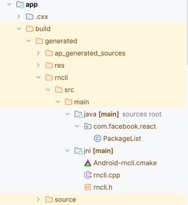

生成好的PackageList代码会在 MainApplication 中被用到。
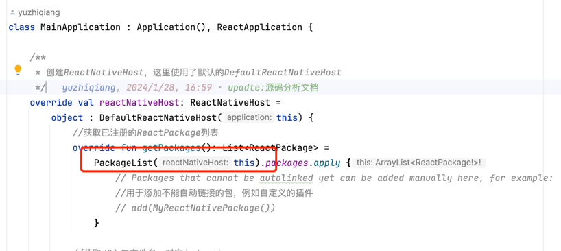

到这里，我们就清楚了，为什么在使用RN插件时，只需要执行一下 `yarn add react-native-device-info`
后就可以直接在前端代码中使用了，而不需要关心native方面的代码。
实际上在Android部分是由gradle插件以及脚本还有结合前端的cli工具，帮我们做了很多事情。

到这里我们基本把 `native_modules.gradle` 中的逻辑分析完毕了，总结一下：

- 通过执行cli命令获取react-native的配置信息，其中包含了react-native的版本，配置，依赖库等关键信息
- 把react-native的依赖库信息进行处理，把模块添加到settings.gradle中，以便于后续在模块中依赖使用
- 把react-native的模块通过源码依赖的方式添加到app模块中
- 生成一个PackageList.java文件，里面包含了所有的react-native模块的信息
- 如果是新架构，还会生成一些新架构所需的文件，主要是jin相关的文件
- 最后在app模块的build.gradle中，会把生成好的PackageList.java文件引入到MainApplication中使用

这样，我们就可以在前端代码中直接使用react-native-device-info这个模块了。

#### 前端cli分析

分析完android的gradle插件和 `native_modules.gradle` 后，我们再来看下前端cli的逻辑。

在 `native_modules.gradle` 的 getReactNativeConfig
方法中，执行了一个node命令，然后得到了非常关键的 `reactNativeConfigOutput`

```Kotlin
        String[] reactNativeConfigCommand = ["node", cliPath, "config"]
        def reactNativeConfigOutput = this.getCommandOutput(reactNativeConfigCommand, this.root)
        println("reactNativeConfigOutput: ${reactNativeConfigOutput}")
```

正是因为有 `reactNativeConfigOutput` 这个关键信息，我们才能执行后续的自动添加依赖的逻辑。

先来看一下 `reactNativeConfigOutput` 的值是什么样子的。

```Kotlin
{
	"root": "/Users/yuzhiqiang/workspace/RN/personal/RNProjectAnalysis",
	"reactNativePath": "/Users/yuzhiqiang/workspace/RN/personal/RNProjectAnalysis/node_modules/react-native",
	"reactNativeVersion": "0.73",
	"dependencies": {
		"react-native-device-info": {
			"root": "/Users/yuzhiqiang/workspace/RN/personal/RNProjectAnalysis/node_modules/react-native-device-info",
			"name": "react-native-device-info",
			"platforms": {
				"ios": {
					"podspecPath": "/Users/yuzhiqiang/workspace/RN/personal/RNProjectAnalysis/node_modules/react-native-device-info/RNDeviceInfo.podspec",
					"version": "10.12.0",
					"configurations": [],
					"scriptPhases": []
				},
				"android": {
					"sourceDir": "/Users/yuzhiqiang/workspace/RN/personal/RNProjectAnalysis/node_modules/react-native-device-info/android",
					"packageImportPath": "import com.learnium.RNDeviceInfo.RNDeviceInfo;",
					"packageInstance": "new RNDeviceInfo()",
					"buildTypes": [],
					"componentDescriptors": [],
					"cmakeListsPath": "/Users/yuzhiqiang/workspace/RN/personal/RNProjectAnalysis/node_modules/react-native-device-info/android/build/generated/source/codegen/jni/CMakeLists.txt"
				}
			}
		}
	},
	"commands": [{
		"name": "log-ios",
		"description": "starts iOS device syslog tail",
		"options": [{
			"name": "--interactive",
			"description": "Explicitly select simulator to tail logs from. By default it will tail logs from the first booted and available simulator."
		}]
	}, {
		"name": "run-ios",
		"description": "builds your app and starts it on iOS simulator",
		"examples": [{
			"desc": "Run on a different simulator, e.g. iPhone SE (2nd generation)",
			"cmd": "npx react-native run-ios --simulator \"iPhone SE (2nd generation)\""
		}, {
			"desc": "Run on a connected device, e.g. Max's iPhone",
			"cmd": "npx react-native run-ios --device \"Max's iPhone\""
		}, {
			"desc": "Run on the AppleTV simulator",
			"cmd": "npx react-native run-ios --simulator \"Apple TV\"  --scheme \"helloworld-tvOS\""
		}],
		"options": [{
			"name": "--mode <string>",
			"description": "Explicitly set the scheme configuration to use. This option is case sensitive."
		}, {
			"name": "--scheme <string>",
			"description": "Explicitly set Xcode scheme to use"
		}, {
			"name": "--destination <string>",
			"description": "Explicitly extend destination e.g. \"arch=x86_64\""
		}, {
			"name": "--verbose",
			"description": "Do not use xcbeautify or xcpretty even if installed"
		}, {
			"name": "--xcconfig [string]",
			"description": "Explicitly set xcconfig to use"
		}, {
			"name": "--buildFolder <string>",
			"description": "Location for iOS build artifacts. Corresponds to Xcode's \"-derivedDataPath\"."
		}, {
			"name": "--extra-params <string>",
			"description": "Custom params that will be passed to xcodebuild command."
		}, {
			"name": "--target <string>",
			"description": "Explicitly set Xcode target to use."
		}, {
			"name": "--interactive",
			"description": "Explicitly select which scheme and configuration to use before running a build"
		}, {
			"name": "--force-pods",
			"description": "Force CocoaPods installation"
		}, {
			"name": "--no-packager",
			"description": "Do not launch packager while running the app"
		}, {
			"name": "--port <number>",
			"default": 8081
		}, {
			"name": "--terminal <string>",
			"description": "Launches the Metro Bundler in a new window using the specified terminal path."
		}, {
			"name": "--binary-path <string>",
			"description": "Path relative to project root where pre-built .app binary lives."
		}, {
			"name": "--list-devices",
			"description": "List all available iOS devices and simulators and let you choose one to run the app. "
		}, {
			"name": "--simulator <string>",
			"description": "Explicitly set the simulator to use. Optionally set the iOS version between parentheses at the end to match an exact version: \"iPhone 15 (17.0)\""
		}, {
			"name": "--device <string>",
			"description": "Explicitly set the device to use by name. The value is not required if you have a single device connected."
		}, {
			"name": "--udid <string>",
			"description": "Explicitly set the device to use by UDID"
		}]
	}, {
		"name": "build-ios",
		"description": "builds your app for iOS platform",
		"examples": [{
			"desc": "Build the app for all iOS devices in Release mode",
			"cmd": "npx react-native build-ios --mode \"Release\""
		}],
		"options": [{
			"name": "--mode <string>",
			"description": "Explicitly set the scheme configuration to use. This option is case sensitive."
		}, {
			"name": "--scheme <string>",
			"description": "Explicitly set Xcode scheme to use"
		}, {
			"name": "--destination <string>",
			"description": "Explicitly extend destination e.g. \"arch=x86_64\""
		}, {
			"name": "--verbose",
			"description": "Do not use xcbeautify or xcpretty even if installed"
		}, {
			"name": "--xcconfig [string]",
			"description": "Explicitly set xcconfig to use"
		}, {
			"name": "--buildFolder <string>",
			"description": "Location for iOS build artifacts. Corresponds to Xcode's \"-derivedDataPath\"."
		}, {
			"name": "--extra-params <string>",
			"description": "Custom params that will be passed to xcodebuild command."
		}, {
			"name": "--target <string>",
			"description": "Explicitly set Xcode target to use."
		}, {
			"name": "--interactive",
			"description": "Explicitly select which scheme and configuration to use before running a build"
		}, {
			"name": "--force-pods",
			"description": "Force CocoaPods installation"
		}]
	}, {
		"name": "log-android",
		"description": "starts logkitty"
	}, {
		"name": "run-android",
		"description": "builds your app and starts it on a connected Android emulator or device",
		"options": [{
			"name": "--mode <string>",
			"description": "Specify your app's build variant"
		}, {
			"name": "--tasks <list>",
			"description": "Run custom Gradle tasks. By default it's \"assembleDebug\". Will override passed mode and variant arguments."
		}, {
			"name": "--active-arch-only",
			"description": "Build native libraries only for the current device architecture for debug builds.",
			"default": false
		}, {
			"name": "--extra-params <string>",
			"description": "Custom params passed to gradle build command"
		}, {
			"name": "--interactive",
			"description": "Explicitly select build type and flavour to use before running a build"
		}, {
			"name": "--no-packager",
			"description": "Do not launch packager while running the app"
		}, {
			"name": "--port <number>",
			"default": 8081
		}, {
			"name": "--terminal <string>",
			"description": "Launches the Metro Bundler in a new window using the specified terminal path."
		}, {
			"name": "--appId <string>",
			"description": "Specify an applicationId to launch after build. If not specified, `package` from AndroidManifest.xml will be used.",
			"default": ""
		}, {
			"name": "--appIdSuffix <string>",
			"description": "Specify an applicationIdSuffix to launch after build.",
			"default": ""
		}, {
			"name": "--main-activity <string>",
			"description": "Name of the activity to start"
		}, {
			"name": "--deviceId <string>",
			"description": "builds your app and starts it on a specific device/simulator with the given device id (listed by running \"adb devices\" on the command line)."
		}, {
			"name": "--list-devices",
			"description": "Lists all available Android devices and simulators and let you choose one to run the app",
			"default": false
		}, {
			"name": "--binary-path <string>",
			"description": "Path relative to project root where pre-built .apk binary lives."
		}, {
			"name": "--user <number>",
			"description": "Id of the User Profile you want to install the app on."
		}]
	}, {
		"name": "build-android",
		"description": "builds your app",
		"options": [{
			"name": "--mode <string>",
			"description": "Specify your app's build variant"
		}, {
			"name": "--tasks <list>",
			"description": "Run custom Gradle tasks. By default it's \"assembleDebug\". Will override passed mode and variant arguments."
		}, {
			"name": "--active-arch-only",
			"description": "Build native libraries only for the current device architecture for debug builds.",
			"default": false
		}, {
			"name": "--extra-params <string>",
			"description": "Custom params passed to gradle build command"
		}, {
			"name": "--interactive",
			"description": "Explicitly select build type and flavour to use before running a build"
		}]
	}, {
		"name": "bundle",
		"description": "Build the bundle for the provided JavaScript entry file.",
		"options": [{
			"name": "--entry-file <path>",
			"description": "Path to the root JS file, either absolute or relative to JS root"
		}, {
			"name": "--platform <string>",
			"description": "Either \"ios\" or \"android\"",
			"default": "ios"
		}, {
			"name": "--transformer <string>",
			"description": "Specify a custom transformer to be used"
		}, {
			"name": "--dev [boolean]",
			"description": "If false, warnings are disabled and the bundle is minified",
			"default": true
		}, {
			"name": "--minify [boolean]",
			"description": "Allows overriding whether bundle is minified. This defaults to false if dev is true, and true if dev is false. Disabling minification can be useful for speeding up production builds for testing purposes."
		}, {
			"name": "--bundle-output <string>",
			"description": "File name where to store the resulting bundle, ex. /tmp/groups.bundle"
		}, {
			"name": "--bundle-encoding <string>",
			"description": "Encoding the bundle should be written in (https://nodejs.org/api/buffer.html#buffer_buffer).",
			"default": "utf8"
		}, {
			"name": "--max-workers <number>",
			"description": "Specifies the maximum number of workers the worker-pool will spawn for transforming files. This defaults to the number of the cores available on your machine."
		}, {
			"name": "--sourcemap-output <string>",
			"description": "File name where to store the sourcemap file for resulting bundle, ex. /tmp/groups.map"
		}, {
			"name": "--sourcemap-sources-root <string>",
			"description": "Path to make sourcemap's sources entries relative to, ex. /root/dir"
		}, {
			"name": "--sourcemap-use-absolute-path",
			"description": "Report SourceMapURL using its full path",
			"default": false
		}, {
			"name": "--assets-dest <string>",
			"description": "Directory name where to store assets referenced in the bundle"
		}, {
			"name": "--unstable-transform-profile <string>",
			"description": "Experimental, transform JS for a specific JS engine. Currently supported: hermes, hermes-canary, default",
			"default": "default"
		}, {
			"name": "--asset-catalog-dest [string]",
			"description": "Path where to create an iOS Asset Catalog for images"
		}, {
			"name": "--reset-cache",
			"description": "Removes cached files",
			"default": false
		}, {
			"name": "--read-global-cache",
			"description": "Try to fetch transformed JS code from the global cache, if configured.",
			"default": false
		}, {
			"name": "--config <string>",
			"description": "Path to the CLI configuration file"
		}]
	}, {
		"name": "ram-bundle",
		"description": "Build the RAM bundle for the provided JavaScript entry file. See https://reactnative.dev/docs/ram-bundles-inline-requires.",
		"options": [{
			"name": "--entry-file <path>",
			"description": "Path to the root JS file, either absolute or relative to JS root"
		}, {
			"name": "--platform <string>",
			"description": "Either \"ios\" or \"android\"",
			"default": "ios"
		}, {
			"name": "--transformer <string>",
			"description": "Specify a custom transformer to be used"
		}, {
			"name": "--dev [boolean]",
			"description": "If false, warnings are disabled and the bundle is minified",
			"default": true
		}, {
			"name": "--minify [boolean]",
			"description": "Allows overriding whether bundle is minified. This defaults to false if dev is true, and true if dev is false. Disabling minification can be useful for speeding up production builds for testing purposes."
		}, {
			"name": "--bundle-output <string>",
			"description": "File name where to store the resulting bundle, ex. /tmp/groups.bundle"
		}, {
			"name": "--bundle-encoding <string>",
			"description": "Encoding the bundle should be written in (https://nodejs.org/api/buffer.html#buffer_buffer).",
			"default": "utf8"
		}, {
			"name": "--max-workers <number>",
			"description": "Specifies the maximum number of workers the worker-pool will spawn for transforming files. This defaults to the number of the cores available on your machine."
		}, {
			"name": "--sourcemap-output <string>",
			"description": "File name where to store the sourcemap file for resulting bundle, ex. /tmp/groups.map"
		}, {
			"name": "--sourcemap-sources-root <string>",
			"description": "Path to make sourcemap's sources entries relative to, ex. /root/dir"
		}, {
			"name": "--sourcemap-use-absolute-path",
			"description": "Report SourceMapURL using its full path",
			"default": false
		}, {
			"name": "--assets-dest <string>",
			"description": "Directory name where to store assets referenced in the bundle"
		}, {
			"name": "--unstable-transform-profile <string>",
			"description": "Experimental, transform JS for a specific JS engine. Currently supported: hermes, hermes-canary, default",
			"default": "default"
		}, {
			"name": "--asset-catalog-dest [string]",
			"description": "Path where to create an iOS Asset Catalog for images"
		}, {
			"name": "--reset-cache",
			"description": "Removes cached files",
			"default": false
		}, {
			"name": "--read-global-cache",
			"description": "Try to fetch transformed JS code from the global cache, if configured.",
			"default": false
		}, {
			"name": "--config <string>",
			"description": "Path to the CLI configuration file"
		}, {
			"name": "--indexed-ram-bundle",
			"description": "Force the \"Indexed RAM\" bundle file format, even when building for android",
			"default": false
		}]
	}, {
		"name": "start",
		"description": "Start the React Native development server.",
		"options": [{
			"name": "--port <number>"
		}, {
			"name": "--host <string>",
			"default": ""
		}, {
			"name": "--projectRoot <path>",
			"description": "Path to a custom project root"
		}, {
			"name": "--watchFolders <list>",
			"description": "Specify any additional folders to be added to the watch list"
		}, {
			"name": "--assetPlugins <list>",
			"description": "Specify any additional asset plugins to be used by the packager by full filepath"
		}, {
			"name": "--sourceExts <list>",
			"description": "Specify any additional source extensions to be used by the packager"
		}, {
			"name": "--max-workers <number>",
			"description": "Specifies the maximum number of workers the worker-pool will spawn for transforming files. This defaults to the number of the cores available on your machine."
		}, {
			"name": "--transformer <string>",
			"description": "Specify a custom transformer to be used"
		}, {
			"name": "--reset-cache, --resetCache",
			"description": "Removes cached files"
		}, {
			"name": "--custom-log-reporter-path, --customLogReporterPath <string>",
			"description": "Path to a JavaScript file that exports a log reporter as a replacement for TerminalReporter"
		}, {
			"name": "--https",
			"description": "Enables https connections to the server"
		}, {
			"name": "--key <path>",
			"description": "Path to custom SSL key"
		}, {
			"name": "--cert <path>",
			"description": "Path to custom SSL cert"
		}, {
			"name": "--config <string>",
			"description": "Path to the CLI configuration file"
		}, {
			"name": "--no-interactive",
			"description": "Disables interactive mode"
		}, {
			"name": "--experimental-debugger",
			"description": "[Experimental] Enable the new debugger experience and 'j' to debug. This enables the new frontend experience only: connection reliability and some basic features are unstable in this release."
		}]
	}],
	"healthChecks": [],
	"platforms": {
		"ios": {},
		"android": {}
	},
	"project": {
		"ios": {
			"sourceDir": "/Users/yuzhiqiang/workspace/RN/personal/RNProjectAnalysis/ios",
			"xcodeProject": {
				"name": "MyProject.xcodeproj",
				"isWorkspace": false
			}
		},
		"android": {
			"sourceDir": "/Users/yuzhiqiang/workspace/RN/personal/RNProjectAnalysis/android",
			"appName": "app",
			"packageName": "com.yzq.rn_project_analysis",
			"applicationId": "com.yzq.rn_project_analysis",
			"mainActivity": ".MainActivity"
		}
	}
}

```

可以看到，实际上就是执行了一个

```Kotlin
node xxx/node_modules/@react-native-community/cli/build/bin.js config
```

命令，最终得到了一个json数据。这个json数据中包含了

- reactNativePath
- reactNativeVersion
- dependencies
- commands
- healthChecks
- platforms
- project

这些关键信息，我们的脚本主要也是用到了这些信息，来自动添加依赖，生成PackageList.java文件等。

那这些信息cli是怎么获取到的呢？

入口在xxx/node_modules/@react-native-community/cli/build/bin.js 文件中，我们先来看下这个文件的源码

```javascript
if (_semver().default.satisfies(process.version, _cliDoctor().versionRanges.NODE_JS)) {
    const {
        run
    } = require('./');
    run();
} else {
    console.error(`${_chalk().default.red(`React Native needs Node.js ${_cliDoctor().versionRanges.NODE_JS}. You're currently on version ${process.version}. Please upgrade Node.js to a supported version and try again.`)}`);
}

```

bin.js的最终执行了一个当前目录下的index.js文件的一个run方法，这个run方法位于同级目录中index.js 中。

```javascript
async function run(platformName) {
    try {
        await setupAndRun(platformName);
    } catch (e) {
        handleError(e);
    }
}

```

随后调用了 `setupAndRun` 方法

```javascript
//获取配置信息
config = (0, _cliConfig().default)();

function _cliConfig() {
    const data = _interopRequireDefault(require("@react-native-community/cli-config"));
    _cliConfig = function () {
        return data;
    };
    return data;
}

```

在 `setupAndRun` 方法中，调用了 `cliConfig` 方法用于获取配置信息，这个方法位于 `@react-native-community/cli-config` 包中。

```javascript
"use strict";

Object.defineProperty(exports, "__esModule", {
    value: true
});
exports.commands = void 0;
Object.defineProperty(exports, "default", {
    enumerable: true,
    get: function () {
        return _loadConfig.default;
    }
});
var _config = _interopRequireDefault(require("./commands/config"));
var _loadConfig = _interopRequireDefault(require("./loadConfig"));

function _interopRequireDefault(obj) {
    return obj && obj.__esModule ? obj : {default: obj};
}

const commands = [_config.default];
exports.commands = commands;

//# sourceMappingURL=index.ts.map
```

cli-config包中的index.js文件中的default默认导出了一个loadConfig方法，看名字该方法就是用来获取配置信息的。

loadConfig 方法位于 `@react-native-community/cli-config` 包中。源码如下
为了方便理解，对代码做了一些拆解和注释

```javascript
function loadConfig(projectRoot = (0, _cliTools().findProjectRoot)()) {
    let lazyProject;
    const userConfig = (0, _readConfigFromDisk.readConfigFromDisk)(projectRoot);

    const initialConfig = {
        root: projectRoot,
        get reactNativePath() {
            const data = userConfig.reactNativePath ? _path().default.resolve(projectRoot, userConfig.reactNativePath) : (0, _resolveReactNativePath.default)(projectRoot);
            return data
        },

        get reactNativeVersion() {
            const verison = getReactNativeVersion(initialConfig.reactNativePath);
            return verison
        },
        dependencies: userConfig.dependencies,
        commands: userConfig.commands,
        healthChecks: [],
        platforms: userConfig.platforms,

        get project() {
            if (lazyProject) {
                return lazyProject;
            }
            lazyProject = {};
            for (const platform in finalConfig.platforms) {
                const platformConfig = finalConfig.platforms[platform];
                if (platformConfig) {
                    lazyProject[platform] = platformConfig.projectConfig(projectRoot, userConfig.project[platform] || {});
                }
            }
            return lazyProject;
        }
    };

    const finalConfig = Array.from(new Set([...Object.keys(userConfig.dependencies), ...(0, _findDependencies.default)(projectRoot)]))
        .reduce((acc, dependencyName) => {
            const localDependencyRoot = userConfig.dependencies[dependencyName] && userConfig.dependencies[dependencyName].root;
            try {
                let root = localDependencyRoot || (0, _cliTools().resolveNodeModuleDir)(projectRoot, dependencyName);

                let config = (0, _readConfigFromDisk.readDependencyConfigFromDisk)(root, dependencyName);

                const isPlatform = Object.keys(config.platforms).length > 0;

                const data = (0, _assign.default)({}, acc, {

                    dependencies: (0, _assign.default)({}, acc.dependencies, {
                        get [dependencyName]() {
                            const result = getDependencyConfig(root, dependencyName, finalConfig, config, userConfig, isPlatform);
                            return result;
                        }
                    }),
                    commands: [...acc.commands, ...config.commands],
                    platforms: {
                        ...acc.platforms,
                        ...config.platforms
                    },
                    healthChecks: [...acc.healthChecks, ...config.healthChecks]
                });

                return data

            } catch {
                return acc;
            }
        }, initialConfig);

    return finalConfig;
}


```

loadConfig 方法是一个非常核心的方法，内部调用了多处其他cli 命令用于获取各种配置信息。

- (0, _cliTools().findProjectRoot)() 调用的是cli-tools包中的findProjectRoot方法，用于获取项目的根目录

    ```javascript
        /**
     * Finds project root by looking for a closest `package.json`.
     */
    function findProjectRoot(cwd = process.cwd()) {
        const packageLocation = _findUp().default.sync('package.json', {
            cwd
        });
        /**
         * It is possible that `package.json` doesn't exist
         * in the tree. In that case, we want to throw an error.
         *
         * When executing via `npx`, this will never happen as `npm`
         * requires that file to be present in order to run.
         */
        if (!packageLocation) {
            throw new _errors.CLIError(`
         We couldn't find a package.json in your project.
         Are you sure you are running it inside a React Native project?
         `);
        }
        return _path().default.dirname(packageLocation);
    }
    
    ```

- 通过执行process.cwd()获取当前node执行的目录，在当前目录下查找package.json文件，如果找到则返回package.json所在的目录，该目录实际上就是RN项目的根目录


- (0, _readConfigFromDisk.readConfigFromDisk)(projectRoot) 调用的是readConfigFromDisk包中的readConfigFromDisk方法，用于获取用户自定义的配置信息
   ```javascript
    //最终找的就是 react-native.config.js 这个文件
    const searchPlaces = ['react-native.config.js'];
   
    function readConfigFromDisk(rootFolder) {
    /**
     * 从react-native目录中的react-native.config.js文件中读取配置信息
     */
    const explorer = (0, _cosmiconfig().default)('react-native', {
        searchPlaces,
        stopDir: rootFolder
    });
    const searchResult = explorer.searchSync(rootFolder);
    const config = searchResult ? searchResult.config : undefined;
    const result = schema.projectConfig.validate(config);
    if (result.error) {
        throw new _errors.JoiError(result.error);
    }
    return result.value;
   }
   ```
    -
  本质上就是从node_modules中的react-native目录中的react-native.config.js文件中读取配置信息，如果不存在该文件，则返回默认值 `{"dependencies":{},"project":{"ios":{},"android":{}},"assets":[],"commands":[],"platforms":{}}`


- 声明一个initialConfig对象，包含了一些默认的配置信息，以及一些getter函数，用于获取reactNativePath，reactNativeVersion，project等信息
   ```javascript
      const initialConfig = {
        root: projectRoot,
        //获取的实际上就是node_modules目录中的react-native目录的绝对路径
        get reactNativePath() {
            const data = userConfig.reactNativePath ? _path().default.resolve(projectRoot, userConfig.reactNativePath) : (0, _resolveReactNativePath.default)(projectRoot);
            return data
        },
        //获取reactNativeVersion，调用的是index.js中的getReactNativeVersion函数
        get reactNativeVersion() {
            const verison = getReactNativeVersion(initialConfig.reactNativePath);
            return verison
        },
        dependencies: userConfig.dependencies,
        commands: userConfig.commands,
        healthChecks: [],
        platforms: userConfig.platforms,
        /*
        * 一个 getter 函数，用于获取项目的配置信息。这里使用了惰性加载（lazy loading），只有在第一次访问 project 属性时才会计算并赋值给 lazyProject。
        * 对于每个平台，都会调用 platformConfig.projectConfig 函数，该函数由各个平台的配置提供。这样，lazyProject 对象中存储了每个平台的项目配置信息。
        * */
        get project() {
            if (lazyProject) {
                return lazyProject;
            }
            lazyProject = {};
            for (const platform in finalConfig.platforms) {
                const platformConfig = finalConfig.platforms[platform];
                if (platformConfig) {
                    lazyProject[platform] = platformConfig.projectConfig(projectRoot, userConfig.project[platform] || {});
                }
            }
            return lazyProject;
        }
    };
  ```
    - reactNativePath：获取react-native的路径，最终获取的就是 node_modules 目录中的 react-native 目录的绝对路径
      ```javascript
       /**
        * Finds path to React Native inside `node_modules` or throws
        * an error otherwise.
        */
   
       function resolveReactNativePath(root) {
         try {
             return (0, _cliTools().resolveNodeModuleDir)(root, 'react-native');
         } catch (_ignored) {
             throw new (_cliTools().CLIError)(`
           Unable to find React Native files looking up from ${root}. Make sure "react-native" module is installed
           in your project dependencies.
   
           If you are using React Native from a non-standard location, consider setting:
           {
             reactNativePath: "./path/to/react-native"
           }
           in your \`react-native.config.js\`.
         `);
         }
      }
      ```

      `resolveReactNativePath` 内部调用了 `resolveNodeModuleDir` ,并且把项目根目录和 `react-native` 字符串作为参数传递

      ```javascript
                  /**
                   * Finds a path inside `node_modules`
                   */
              function resolveNodeModuleDir(root, packageName) {
                const packageDependencyDirectory = (0, _findPackageDependencyDir.findPackageDependencyDir)(packageName, {
                    startDir: root
                });
                if (packageDependencyDirectory === undefined) {
                    throw new _errors.CLIError(`Node module directory for package ${packageName} was not found`);
                } else {
                    return packageDependencyDirectory;
                }
               }
      ```

      `resolveNodeModuleDir` 又调用了 `findPackageDependencyDir` 方法，实际上就是从node_modules中找出给定的 `pkgName`
      的目录，如果找不到则返回undefined

      ```javascript
      /**
       * Find the package dependency's directory, starting from the given directory
       * and moving outward, through all parent directories.
       *
       * Package dependencies exist under 'node_modules/[`scope`]/[`name`]'.
       *
       * @param ref Package dependency reference
       * @param options Options which control the search
       * @returns Path to the package dependency's directory, or `undefined` if not found.
       */
       function findPackageDependencyDir(ref, options) {
   
       const pkgName = typeof ref === 'string' ? ref : path().join(ref.scope ?? '', ref.name);
       const packageDir = _findUp().default.sync(path().join('node_modules', pkgName), {
           ...pickValues(options ?? {}, ['startDir', 'allowSymlinks'], ['cwd', 'allowSymlinks']),
           type: 'directory'
       });
       if (!packageDir || !(options === null || options === void 0 ? void 0 : options.resolveSymlinks)) {
           return packageDir;
       }
       return fs().lstatSync(packageDir).isSymbolicLink() ? path().resolve(path().dirname(packageDir), fs().readlinkSync(packageDir)) : packageDir;
      }
   
      ```
    - reactNativeVersion：获取react-native的版本号，调用的是getReactNativeVersion方法
      ```javascript
         // Try our best to figure out what version of React Native we're running. This is
         // currently being used to get our deeplinks working, so it's only worried with
         // the major and minor version.
   
         function getReactNativeVersion(reactNativePath) {
            try {
               let semver = _cliTools().version.current(reactNativePath);
               if (semver) {
                  // Retain only these version, since they correspond with our documentation.
                  return `${semver.major}.${semver.minor}`;
               }
            } catch (e) {
               // If we don't seem to be in a well formed project, give up quietly.
               if (!(e instanceof _cliTools().UnknownProjectError)) {
              throw e;
               }
            }
            return 'unknown';
         }
      ```

        - `getReactNativeVersion` 内部调用了 `version.current` 方法，该方法位于cli-tools包中，用于获取react-native的版本号
            ```javascript
            function current(projectRoot) {
               try {
                  const found = _semver().default.parse(getReactNativeVersion(projectRoot));
                  if (found) {
                     return found;
                  }
               } catch {
                  throw new _errors.UnknownProjectError(projectRoot);
               }
               return undefined;
            }
            ```

        - `version.current` 方法内部调用了 `getReactNativeVersion` 方法，该方法位于cli-tools包中，用于获取react-native的版本号
            ```javascript
            const getReactNativeVersion = projectRoot => {
                var _require;
                /**
                 * 这里最终获取的是projectRoot路径下加载的 package.json 中的 version 属性的值。
                 */
                return (_require = require(_path().default.join((0, _resolveNodeModuleDir.default)(projectRoot, 'react-native'), 'package.json'))) === null || _require === void 0 ? void 0 : _require.version;
            };
            ```
    - `project()` 用于获取对应平台的项目信息
        ```javascript
        get project() {
            if (lazyProject) {
                return lazyProject;
            }
            lazyProject = {};
            for (const platform in finalConfig.platforms) {
                const platformConfig = finalConfig.platforms[platform];
                if (platformConfig) {
                    lazyProject[platform] = platformConfig.projectConfig(projectRoot, userConfig.project[platform] || {});
                }
            }
            return lazyProject;
        }
        ```
      通过遍历 `finalConfig.platforms` 中的每个平台，调用 `platformConfig.projectConfig`
      方法获取对应平台的项目配置信息.`platformConfig.projectConfig`
      会调用对应平台的方法，例如android调用的是`cli-platform-android`包中的`projectConfig`方法
        ```javascript
          /**
           * Gets android project config by analyzing given folder and taking some
           * defaults specified by user into consideration
           */
          function projectConfig(root, userConfig = {}) {
              const src = userConfig.sourceDir || (0, _findAndroidDir.default)(root);
              if (!src) {
                  return null;
              }
              const sourceDir = _path().default.join(root, src);
              const appName = getAppName(sourceDir, userConfig.appName);
              const manifestPath = userConfig.manifestPath ? _path().default.join(sourceDir, userConfig.manifestPath) : (0, _findManifest.default)(_path().default.join(sourceDir, appName));
              const buildGradlePath = (0, _findBuildGradle.findBuildGradle)(sourceDir, false);
              if (!manifestPath && !buildGradlePath) {
                  return null;
              }
              const packageName = userConfig.packageName || (0, _getAndroidProject.getPackageName)(manifestPath, buildGradlePath);
              if (!packageName) {
                  throw new (_cliTools().CLIError)(`Package name not found in neither ${manifestPath} nor ${buildGradlePath}`);
              }
              const applicationId = buildGradlePath ? getApplicationId(buildGradlePath, packageName) : packageName;
              const mainActivity = (0, _getMainActivity.default)(manifestPath || '') ?? '';
              return {
                  sourceDir,
                  appName,
                  packageName,
                  applicationId,
                  mainActivity,
                  dependencyConfiguration: userConfig.dependencyConfiguration,
                  watchModeCommandParams: userConfig.watchModeCommandParams,
                  unstable_reactLegacyComponentNames: userConfig.unstable_reactLegacyComponentNames
              };
          }
      ```
        - `findAndroidDir` 方法用于查找android目录,其实就是找项目根目录下的android文件夹
          ```javascript
          function findAndroidDir(root) {
          if (_fs().default.existsSync(_path().default.join(root, 'android'))) {
          return 'android';
          }
          return null;
          }
          ```
        - `sourceDir` 就是android目录下的src目录的路径

        - `getAppName` 就是获取android项目中app模块的目录名。如果用户配置了appName，则使用用户配置的appName，否则默认就是app
            ```javascript
            function getAppName(sourceDir, userConfigAppName) {
                let appName = '';
                //如果用户配置了appName并且是字符串类型，并且在sourceDir目录下存在这个文件夹
                if (typeof userConfigAppName === 'string' && _fs().default.existsSync(_path().default.join(sourceDir, userConfigAppName))) {
                    appName = userConfigAppName;
                } else if (_fs().default.existsSync(_path().default.join(sourceDir, 'app'))) {
                    //默认返回app
                    appName = 'app';
                }
                return appName;
            }
            ```   
        - `findManifest` 方法用于查找android项目中的AndroidManifest.xml文件
           ```javascript
           /**
            * 找到AndroidManifest.xml文件
            * 根据指定的文件夹和忽略规则，获取所有匹配 AndroidManifest.xml 的文件路径。
            * 如果有多个 AndroidManifest.xml 文件，选择 src/main/ 下的文件。
            * 随后返回第一个匹配的文件路径。
            * @param folder
            * @returns {*|null}
            */
           function findManifest(folder) {
             let manifestPaths = _glob().default.sync(_path().default.join('**', 'AndroidManifest.xml'), {
               cwd: folder,
               ignore: ['node_modules/**', '**/build/**', '**/debug/**', 'Examples/**', 'examples/**', '**/Pods/**', '**/sdks/hermes/android/**', '**/src/androidTest/**', '**/src/test/**']
             });
             if (manifestPaths.length > 1) {
               // if we have more than one manifest, pick the one in the main folder if present
               const mainManifest = manifestPaths.filter(manifestPath => manifestPath.includes('src/main/'));
               if (mainManifest.length === 1) {
                 manifestPaths = mainManifest;
               }
             }
             return manifestPaths[0] ? _path().default.join(folder, manifestPaths[0]) : null;
           }
           ```
        - `findBuildGradle` 方法用于查找android项目中的build.gradle文件
           ```javascript
          
           /**
            * 获取build.gradle文件路径
            * 如果是library项目，返回build.gradle，否则返回app/build.gradle
            * 如果存在build.gradle.kts文件，则返回build.gradle.kts，否则返回build.gradle
            * @param sourceDir
            * @param isLibrary
            * @returns {*|null}
            */
           function findBuildGradle(sourceDir, isLibrary) {
               const buildGradlePath = _path().default.join(sourceDir, isLibrary ? 'build.gradle' : 'app/build.gradle');
               const buildGradleKtsPath = _path().default.join(sourceDir, isLibrary ? 'build.gradle.kts' : 'app/build.gradle.kts');
               if (_fs().default.existsSync(buildGradlePath)) {
                   return buildGradlePath;
               } else if (_fs().default.existsSync(buildGradleKtsPath)) {
                   return buildGradleKtsPath;
               } else {
                   return null;
               }
           }
           ```
        - `getPackageName` 方法用于获取android项目的包名
           ```javascript
           /**
            * 获取android项目的包名
            * @param manifestPath
            * @param buildGradlePath
            * @returns {*}
            */
           function getPackageName(manifestPath, buildGradlePath) {
               let packageName = discoverPackageName(manifestPath, buildGradlePath);
               if (!validatePackageName(packageName)) {
                   _cliTools().logger.warn(`Invalid application's package name "${_chalk().default.bgRed(packageName)}" in either 'AndroidManifest.xml' or 'build.gradle'. Read guidelines for setting the package name here: ${_chalk().default.underline.dim('https://developer.android.com/studio/build/application-id')}`);
               }
               return packageName;
           }
           ```
          内部调用了 `discoverPackageName` 方法，用于从AndroidManifest.xml文件或者build.gradle文件中获取包名
           ```javascript
           /**
            * 先从清单配置文件中获取包名，如果没有获取到，则从build.gradle文件中获取命名空间
            * @param manifestPath
            * @param buildGradlePath
            * @returns {*}
            */
           function discoverPackageName(manifestPath, buildGradlePath) {
               if (manifestPath) {
                   const androidManifest = _fs().default.readFileSync(manifestPath, 'utf8');
                   const packageNameFromManifest = parsePackageNameFromAndroidManifestFile(androidManifest);
                   // We got the package from the AndroidManifest.xml
                   if (packageNameFromManifest) {
                       return packageNameFromManifest;
                   }
               }
               if (buildGradlePath) {
                   // We didn't get the package from the AndroidManifest.xml,
                   // so we'll try to get it from the build.gradle[.kts] file
                   // via the namespace field.
                   const buildGradle = _fs().default.readFileSync(buildGradlePath, 'utf8');
                   const namespace = parseNamespaceFromBuildGradleFile(buildGradle);
                   if (namespace) {
                       return namespace;
                   }
               }
               throw new (_cliTools().CLIError)(`Failed to build the app: No package name found. 
               We couldn't parse the namespace from neither your build.gradle[.kts] file at ${_chalk().default.underline.dim(`${buildGradlePath}`)} 
               nor your package in the AndroidManifest at ${_chalk().default.underline.dim(`${manifestPath}`)}
               `);
           }
           ```
          `discoverPackageName` 方法内部调用了 `parsePackageNameFromAndroidManifestFile`
          方法，用于从AndroidManifest.xml文件中获取包名
           ```javascript
           /**
            * 从AndroidManifest.xml文件中解析包名，其实就是获取package属性的值
            * @param androidManifest
            * @returns {*|null}
            */
           function parsePackageNameFromAndroidManifestFile(androidManifest) {
               const matchArray = androidManifest.match(/package="(.+?)"/);
               if (matchArray && matchArray.length > 0) {
                   return matchArray[1];
               } else {
                   return null;
               }
           }
           ```
        - `getApplicationId` 方法用于从build.gradle文件中获取包名
            ```javascript
            function getApplicationId(buildGradlePath, packageName) {
               let appId = packageName;
               const applicationId = (0, _getAndroidProject.parseApplicationIdFromBuildGradleFile)(buildGradlePath);
               if (applicationId) {
                  appId = applicationId;
               }
               return appId;
            }
            ```
          `getApplicationId` 方法内部调用了 `parseApplicationIdFromBuildGradleFile` 方法，用于从build.gradle文件中获取包名
            ```javascript
            /**
             * 从build.gradle文件中解析应用程序ID
             * 如果build.gradle中存在applicationId字段，则返回该字段的值，否则返回null
             * @param buildGradlePath
             * @returns {*|string|null}
             */
            function parseApplicationIdFromBuildGradleFile(buildGradlePath) {
                if (!buildGradlePath) {
                    return null;
                }
                const buildGradle = _fs().default.readFileSync(buildGradlePath, 'utf8');
                const matchArray = buildGradle.match(/defaultConfig\s*{([\s\S]*?)}/);
                if (matchArray && matchArray.length > 0) {
                    const appIdMatchArray = matchArray[1].match(/applicationId\s*[=]*\s*["'](.+?)["']/);
                    return (appIdMatchArray === null || appIdMatchArray === void 0 ? void 0 : appIdMatchArray[1]) ?? '';
                } else {
                    return null;
                }
            }
            ```
        - `getMainActivity` 方法用于获取android项目中的入口页面
            ```javascript
            /**
             * 通过解析 AndroidManifest.xml 文件，获取主 Activity 名称。
             * 找到activities节点下的intent-filter节点，包含action和category节点，且action节点的name为android.intent.action.MAIN，category节点的name为android.intent.category.LAUNCHER的activity节点。
             * @param manifestPath
             * @returns {any|null}
             */
            function getMainActivity(manifestPath) {
                try {
                    const xmlParser = new (_fastXmlParser().XMLParser)({
                        ignoreAttributes: false
                    });
                    const manifestContent = _fs().default.readFileSync(manifestPath, {
                        encoding: 'utf8'
                    });
                    if (_fastXmlParser().XMLValidator.validate(manifestContent)) {
                        const {
                            manifest
                        } = xmlParser.parse(manifestContent);
                        const application = manifest.application || {};
                        const activity = application.activity || {};
                        let activities = [];
                        if (!Array.isArray(activity)) {
                            activities = [activity];
                        } else {
                            activities = activity;
                        }
                        const mainActivity = activities.find(act => {
                            let intentFilters = act['intent-filter'];
                            if (!intentFilters) {
                                return false;
                            }
                            if (!Array.isArray(intentFilters)) {
                                intentFilters = [intentFilters];
                            }
                            return intentFilters.find(intentFilter => {
                                const {
                                    action,
                                    category
                                } = intentFilter;
                                let actions;
                                let categories;
                                if (!Array.isArray(action)) {
                                    actions = [action];
                                } else {
                                    actions = action;
                                }
                                if (!Array.isArray(category)) {
                                    categories = [category];
                                } else {
                                    categories = category;
                                }
                                if (actions && categories) {
                                    const parsedActions = actions.map(({
                                                                           '@_android:name': name
                                                                       }) => name);
                                    const parsedCategories = categories.map(({
                                                                                 '@_android:name': name
                                                                             }) => name);
                                    return parsedActions.includes(MAIN_ACTION) && parsedCategories.includes(LAUNCHER);
                                }
                                return false;
                            });
                        });
                        return mainActivity ? mainActivity['@_android:name'] : null;
                    } else {
                        return null;
                    }
                } catch {
                    return null;
                }
            }
             
            ```
- 声明一个 finalConfig 对象,初始值是 initialConfig，最终会把用户配置的 `dependencies` 以及通过 `_findDependencies`
  获取的依赖数据进行遍历累积处理，得到最终数据。
    - `_findDependencies` 方法用于获取RN项目的依赖信息，实际上就是把package.json中的dependencies和devDependencies字段的值合并成一个数组返回
      ```javascript
             /**
              * 获取项目根目录中的package.json中的依赖项,就是把package.json中的dependencies和devDependencies 配置中的key 合并成一个数组返回
              * @param root
              * @returns {string[]|*[]}
              */
             function findDependencies(root) {
                 let pjson;
                 try {
                     pjson = JSON.parse(_fs().default.readFileSync(_path().default.join(root, 'package.json'), 'utf8'));
                 } catch (e) {
                     return [];
                 }
                 const deps = [...Object.keys(pjson.dependencies || {}), ...Object.keys(pjson.devDependencies || {})];
                 return deps;
             }
      ```

    - `Array.from(new Set([...Object.keys(userConfig.dependencies), ...(0, _findDependencies.default)(projectRoot)]))`
        - 用于把用户配置的 `dependencies` 以及通过 `_findDependencies` 获取的依赖数据进行遍历累积处理，得到最终数据。
        - 随后通过reduce方法，对依赖数据进行迭代处理并累积
            - 首先是通过 `resolveNodeModuleDir` 获取对应依赖模块的根目录
              ```javascript
                               /**
                                * Finds a path inside `node_modules`
                                */
                                 function resolveNodeModuleDir(root, packageName) {
                                     const packageDependencyDirectory = (0, _findPackageDependencyDir.findPackageDependencyDir)(packageName, {
                                     startDir: root
                                   });
                                   if (packageDependencyDirectory === undefined) {
                                     throw new _errors.CLIError(`Node module directory for package ${packageName} was not found`);
                                   } else {
                                     return packageDependencyDirectory;
                                   }
                                 }
              ```
              内部调用了 _`findPackageDependencyDir` 方法获取node_modules下的依赖模块的目录

            - 接下来通过 `readDependencyConfigFromDisk` 函数读取依赖模块中的配置信息。实际上，这个函数是用来读取 React
              Native
              项目中依赖模块的 `react-native.config.js`
              文件中的配置信息的。一般来说，其他依赖项目中是没有 `react-native.config.js` 文件的，因此在这里可能会抛出异常，但是这并不会影响最终的结果。
              ```javascript
        
              /**
              * 读取开发人员在`node_modules`中定义的依赖项的配置。
              * 返回值格式：{"dependency":{"platforms":{}},"commands":[],"platforms":{},"healthChecks":[]}
              * @param rootFolder  依赖库的根目录
              * @param dependencyName 依赖库的名称
              * @returns {*}
                */
                function readDependencyConfigFromDisk(rootFolder, dependencyName) {
                  const explorer = (0, _cosmiconfig().default)('react-native', {
                  stopDir: rootFolder,
                  searchPlaces
                });
                  const config = searchResult ? searchResult.config : emptyDependencyConfig;
                  const result = schema.dependencyConfig.validate(config, {abortEarly: false
                  });
                  if (result.error) {const validationError = new _errors.JoiError(result.error);_cliTools().logger.warn((0, _cliTools().inlineString)(`
                   Package ${_chalk().default.bold(dependencyName)} contains invalid configuration: ${_chalk().default.bold(validationError.message)}.
               
                  Please verify it's properly linked using "npx react-native config" command and contact the package maintainers about this.`));
                  }
                  return result.value;
                  }
              ```
            - 最后通过 `assign` 方法把 `acc` 和 新得到的对象 合并成一个新的对象返回
              ```javascript
              /*
              * assign:用于合并数据，后面的属性会覆盖前面的
              * 目的是把acc的属性以及后面代码块中的属性合并到一个新的对象中返回出去
              * 其中，dependencies是在后续属性被访问时才会执行到。
              * */
                
              return (0, _assign.default)({}, acc, {
                        //dependencies会在属性被访问时才执行
                        dependencies: (0, _assign.default)({}, acc.dependencies, {
                            get [dependencyName]() {
                                const result = getDependencyConfig(root, dependencyName, finalConfig, config, userConfig, isPlatform);
                                return result;
                            }
                        }),
                        commands: [...acc.commands, ...config.commands],
                        platforms: {
                            ...acc.platforms,
                            ...config.platforms
                        },
                        healthChecks: [...acc.healthChecks, ...config.healthChecks]
                    });
                ```
              在assign代码块中，我们需要重点关注下dependencies属性，这里使用了getter函数，在dependencies属性被访问时会
              调用 `getDependencyConfig` 方法，用于获取依赖模块的配置信息
              ```javascript
              function getDependencyConfig(root, dependencyName, finalConfig, config, userConfig, isPlatform) {
                  return (0, _merge.default)({
                      root,
                      name: dependencyName,
                      platforms: Object.keys(finalConfig.platforms).reduce((dependency, platform) => {
                          const platformConfig = finalConfig.platforms[platform];
                          dependency[platform] =
                              // Linking platforms is not supported
                              isPlatform || !platformConfig ? null : platformConfig.dependencyConfig(root, config.dependency.platforms[platform]);
                          return dependency;
                      }, {})
                  }, userConfig.dependencies[dependencyName] || {});
              }
              ```
              getDependencyConfig中，通过 `merge` 方法把 `root`，`name`，`platforms`
              和 `userConfig.dependencies[dependencyName]` 合并成一个新的对象返回
              这里要重点看一下 `platformConfig.dependencyConfig` 方法
              ```javascript
              function dependencyConfig(root, userConfig = {}) {
                
                  if (userConfig === null) {
                      return null;
                  }
                  //获取android目录
                  const src = userConfig.sourceDir || (0, _findAndroidDir.default)(root);
                
                  if (!src) {
                      return null;
                  }
                  //获取android目录的绝对路径
                  const sourceDir = _path().default.join(root, src);
                  //获取AndroidManifest.xml文件路径
                  const manifestPath = userConfig.manifestPath ? _path().default.join(sourceDir, userConfig.manifestPath) : (0, _findManifest.default)(sourceDir);
                  //获取build.gradle文件路径
                  const buildGradlePath = (0, _findBuildGradle.findBuildGradle)(sourceDir, true);
                  //如果AndroidManifest.xml文件和build.gradle文件都不存在，则返回null
                  if (!manifestPath && !buildGradlePath) {
                      return null;
                  }
                  //获取包名
                  const packageName = userConfig.packageName || (0, _getAndroidProject.getPackageName)(manifestPath, buildGradlePath);
                  //获取 包下面指定的类名
                  const packageClassName = (0, _findPackageClassName.default)(sourceDir);
                    
                  /**
                   * This module has no package to export
                   */
                  if (!packageClassName) {
                      return null;
                  }
                  //获取包的导入路径
                  const packageImportPath = userConfig.packageImportPath || `import ${packageName}.${packageClassName};`
                  //生成创建类实例的代码
                  const packageInstance = userConfig.packageInstance || `new ${packageClassName}()`;
                  //获取 buildTypes
                  const buildTypes = userConfig.buildTypes || [];
                  //获取 dependencyConfiguration
                  const dependencyConfiguration = userConfig.dependencyConfiguration;
                  //获取 libraryName
                  const libraryName = userConfig.libraryName || (0, _findLibraryName.findLibraryName)(root, sourceDir);
                  //获取 componentDescriptors
                  const componentDescriptors = userConfig.componentDescriptors || (0, _findComponentDescriptors.findComponentDescriptors)(root);
                  //获取 cmakeListsPath
                  let cmakeListsPath = userConfig.cmakeListsPath ? _path().default.join(sourceDir, userConfig.cmakeListsPath) : _path().default.join(sourceDir, 'build/generated/source/codegen/jni/CMakeLists.txt');
                  if (process.platform === 'win32') {
                      cmakeListsPath = cmakeListsPath.replace(/\\/g, '/');
                  }
                 
                  return {
                      sourceDir,
                      packageImportPath,
                      packageInstance,
                      buildTypes,
                      dependencyConfiguration,
                      libraryName,
                      componentDescriptors,
                      cmakeListsPath
                  };
              }
                
                
              ```
              前面几个在分析 `projectConfig` 方法时已经分析过了，我们从 `packageClassName` 开始看
                - `packageClassName` 用于获取包下面指定的类名，最终调用了 `getPackageClassName` 方法
                   ```javascript
                      function getPackageClassName(folder) {
                          const files = _glob().default.sync('**/+(*.java|*.kt)', {
                              cwd: folder
                          });
                          const packages = files.map(filePath => _fs().default.readFileSync(_path().default.join(folder, filePath), 'utf8')).map(matchClassName).filter(match => match);
                          console.log(`getPackageClassName: packages=${JSON.stringify(packages)}`)
                          // @ts-ignore
                          //返回第一个匹配的类名
                          return packages.length ? packages[0][1] : null;
                       }
                   ```
                  `getPackageClassName` 方法内部调用了 `matchClassName` 方法，找出匹配的类名
                   ```javascript
                     /**
                      * 找到匹配的类名
                      * 先查找 implements ReactPackage 的类，存在就直接返回
                      * 如果不存在然后查找 extends TurboReactPackage 的子类
                      * @param file
                      * @returns {*}
                      */
                      function matchClassName(file) {
                      const nativeModuleMatch = file.match(/class\s+(\w+[^(\s]*)[\s\w():]*(\s+implements\s+|:)[\s\w():,]*[^{]*ReactPackage/);
                      // We first check for implementation of ReactPackage to find native
                      // modules and then for subclasses of TurboReactPackage to find turbo modules.
                        
                          if (nativeModuleMatch) {
                              return nativeModuleMatch;
                          } else {
                              //返回
                              return file.match(/class\s+(\w+[^(\s]*)[\s\w():]*(\s+extends\s+|:)[\s\w():,]*[^{]*TurboReactPackage/);
                          }
                      }
                   ```
                - packageImportPath:
                  获取包的导入路径，如果用户配置了packageImportPath，则使用用户配置的packageImportPath，否则默认就是 `import ${packageName}.${packageClassName};`
                - packageInstance:
                  生成创建类实例的代码，如果用户配置了packageInstance，则使用用户配置的packageInstance，否则默认就是 `new ${packageClassName}()`
                - buildTypes: 获取 buildTypes，如果用户配置了buildTypes，则使用用户配置的buildTypes，否则默认就是空数组
                - dependencyConfiguration: 获取
                  dependencyConfiguration，如果用户配置了dependencyConfiguration，则使用用户配置的dependencyConfiguration，否则默认就是null
                - libraryName: 获取 libraryName，调用的是 `findLibraryName`方法，从依赖库的配置文件（package.json、build.gradle
                  或 build.gradle.kts）中获取库的名称。如果没有获取到就返回undefined
                - componentDescriptors: 获取 componentDescriptors，调用的是 `findComponentDescriptors`
                  方法，用于获取依赖库中的组件描述信息。如果没有获取到就返回null
                - cmakeListsPath: 根据用户配置的 cmakeListsPath 或者使用默认路径，拼接生成 CMakeLists.txt 文件的路径。如果用户提供了
                  cmakeListsPath，则使用用户提供的路径；否则，使用默认路径：sourceDir/build/generated/source/codegen/jni/CMakeLists.txt。

- 最后返回finalConfig对象 也就是说 `config = (0, _cliConfig().default)();`
  执行完毕后,就能够获取到大部分的配置信息了，例如dependencies，reactNativePath，reactNativeVersion
  其中有些属性是在被访问时才会执行的，这样就能够保证在访问时才会执行的属性能够获取到最新的数据。

下面是config结果的输出示例：

```json
{
  "root": "/Users/yuzhiqiang/workspace/RN/personal/RNProjectAnalysis",
  "reactNativePath": "/Users/yuzhiqiang/workspace/RN/personal/RNProjectAnalysis/node_modules/react-native",
  "reactNativeVersion": "0.73",
  "dependencies": {
    "react": {
      "root": "/Users/yuzhiqiang/workspace/RN/personal/RNProjectAnalysis/node_modules/react",
      "name": "react",
      "platforms": {
        "ios": null,
        "android": null
      }
    },
    "react-native": {
      "root": "/Users/yuzhiqiang/workspace/RN/personal/RNProjectAnalysis/node_modules/react-native",
      "name": "react-native",
      "platforms": {
        "ios": null,
        "android": null
      }
    },
    "react-native-device-info": {
      "root": "/Users/yuzhiqiang/workspace/RN/personal/RNProjectAnalysis/node_modules/react-native-device-info",
      "name": "react-native-device-info",
      "platforms": {
        "ios": {
          "podspecPath": "/Users/yuzhiqiang/workspace/RN/personal/RNProjectAnalysis/node_modules/react-native-device-info/RNDeviceInfo.podspec",
          "version": "10.12.0",
          "configurations": [

          ],
          "scriptPhases": [

          ]
        },
        "android": {
          "sourceDir": "/Users/yuzhiqiang/workspace/RN/personal/RNProjectAnalysis/node_modules/react-native-device-info/android",
          "packageImportPath": "import com.learnium.RNDeviceInfo.RNDeviceInfo;",
          "packageInstance": "new RNDeviceInfo()",
          "buildTypes": [

          ],
          "componentDescriptors": [

          ],
          "cmakeListsPath": "/Users/yuzhiqiang/workspace/RN/personal/RNProjectAnalysis/node_modules/react-native-device-info/android/build/generated/source/codegen/jni/CMakeLists.txt"
        }
      }
    },
    "@babel/core": {
      "root": "/Users/yuzhiqiang/workspace/RN/personal/RNProjectAnalysis/node_modules/@babel/core",
      "name": "@babel/core",
      "platforms": {
        "ios": null,
        "android": null
      }
    },
    "@babel/preset-env": {
      "root": "/Users/yuzhiqiang/workspace/RN/personal/RNProjectAnalysis/node_modules/@babel/preset-env",
      "name": "@babel/preset-env",
      "platforms": {
        "ios": null,
        "android": null
      }
    },
    "@babel/runtime": {
      "root": "/Users/yuzhiqiang/workspace/RN/personal/RNProjectAnalysis/node_modules/@babel/runtime",
      "name": "@babel/runtime",
      "platforms": {
        "ios": null,
        "android": null
      }
    },
    "@react-native/babel-preset": {
      "root": "/Users/yuzhiqiang/workspace/RN/personal/RNProjectAnalysis/node_modules/@react-native/babel-preset",
      "name": "@react-native/babel-preset",
      "platforms": {
        "ios": null,
        "android": null
      }
    },
    "@react-native/eslint-config": {
      "root": "/Users/yuzhiqiang/workspace/RN/personal/RNProjectAnalysis/node_modules/@react-native/eslint-config",
      "name": "@react-native/eslint-config",
      "platforms": {
        "ios": null,
        "android": null
      }
    },
    "@react-native/metro-config": {
      "root": "/Users/yuzhiqiang/workspace/RN/personal/RNProjectAnalysis/node_modules/@react-native/metro-config",
      "name": "@react-native/metro-config",
      "platforms": {
        "ios": null,
        "android": null
      }
    },
    "@react-native/typescript-config": {
      "root": "/Users/yuzhiqiang/workspace/RN/personal/RNProjectAnalysis/node_modules/@react-native/typescript-config",
      "name": "@react-native/typescript-config",
      "platforms": {
        "ios": null,
        "android": null
      }
    },
    "@types/react": {
      "root": "/Users/yuzhiqiang/workspace/RN/personal/RNProjectAnalysis/node_modules/@types/react",
      "name": "@types/react",
      "platforms": {
        "ios": null,
        "android": null
      }
    },
    "@types/react-test-renderer": {
      "root": "/Users/yuzhiqiang/workspace/RN/personal/RNProjectAnalysis/node_modules/@types/react-test-renderer",
      "name": "@types/react-test-renderer",
      "platforms": {
        "ios": null,
        "android": null
      }
    },
    "babel-jest": {
      "root": "/Users/yuzhiqiang/workspace/RN/personal/RNProjectAnalysis/node_modules/babel-jest",
      "name": "babel-jest",
      "platforms": {
        "ios": null,
        "android": null
      }
    },
    "eslint": {
      "root": "/Users/yuzhiqiang/workspace/RN/personal/RNProjectAnalysis/node_modules/eslint",
      "name": "eslint",
      "platforms": {
        "ios": null,
        "android": null
      }
    },
    "jest": {
      "root": "/Users/yuzhiqiang/workspace/RN/personal/RNProjectAnalysis/node_modules/jest",
      "name": "jest",
      "platforms": {
        "ios": null,
        "android": null
      }
    },
    "prettier": {
      "root": "/Users/yuzhiqiang/workspace/RN/personal/RNProjectAnalysis/node_modules/prettier",
      "name": "prettier",
      "platforms": {
        "ios": null,
        "android": null
      }
    },
    "react-test-renderer": {
      "root": "/Users/yuzhiqiang/workspace/RN/personal/RNProjectAnalysis/node_modules/react-test-renderer",
      "name": "react-test-renderer",
      "platforms": {
        "ios": null,
        "android": null
      }
    },
    "typescript": {
      "root": "/Users/yuzhiqiang/workspace/RN/personal/RNProjectAnalysis/node_modules/typescript",
      "name": "typescript",
      "platforms": {
        "ios": null,
        "android": null
      }
    }
  },
  "commands": [
    {
      "name": "log-ios",
      "description": "starts iOS device syslog tail",
      "options": [
        {
          "name": "--interactive",
          "description": "Explicitly select simulator to tail logs from. By default it will tail logs from the first booted and available simulator."
        }
      ]
    },
    {
      "name": "run-ios",
      "description": "builds your app and starts it on iOS simulator",
      "examples": [
        {
          "desc": "Run on a different simulator, e.g. iPhone SE (2nd generation)",
          "cmd": "npx react-native run-ios --simulator \"iPhoneSE(2ndgeneration)\""
        },
        {
          "desc": "Run on a connected device, e.g. Max's iPhone",
          "cmd": "npx react-native run-ios --device \"Max'siPhone\""
        },
        {
          "desc": "Run on the AppleTV simulator",
          "cmd": "npx react-native run-ios --simulator \"AppleTV\"  --scheme \"helloworld-tvOS\""
        }
      ],
      "options": [
        {
          "name": "--mode <string>",
          "description": "Explicitly set the scheme configuration to use. This option is case sensitive."
        },
        {
          "name": "--scheme <string>",
          "description": "Explicitly set Xcode scheme to use"
        },
        {
          "name": "--destination <string>",
          "description": "Explicitly extend destination e.g. \"arch=x86_64\""
        },
        {
          "name": "--verbose",
          "description": "Do not use xcbeautify or xcpretty even if installed"
        },
        {
          "name": "--xcconfig [string]",
          "description": "Explicitly set xcconfig to use"
        },
        {
          "name": "--buildFolder <string>",
          "description": "Location for iOS build artifacts. Corresponds to Xcode's \"-derivedDataPath\"."
        },
        {
          "name": "--extra-params <string>",
          "description": "Custom params that will be passed to xcodebuild command."
        },
        {
          "name": "--target <string>",
          "description": "Explicitly set Xcode target to use."
        },
        {
          "name": "--interactive",
          "description": "Explicitly select which scheme and configuration to use before running a build"
        },
        {
          "name": "--force-pods",
          "description": "Force CocoaPods installation"
        },
        {
          "name": "--no-packager",
          "description": "Do not launch packager while running the app"
        },
        {
          "name": "--port <number>",
          "default": 8081
        },
        {
          "name": "--terminal <string>",
          "description": "Launches the Metro Bundler in a new window using the specified terminal path."
        },
        {
          "name": "--binary-path <string>",
          "description": "Path relative to project root where pre-built .app binary lives."
        },
        {
          "name": "--list-devices",
          "description": "List all available iOS devices and simulators and let you choose one to run the app. "
        },
        {
          "name": "--simulator <string>",
          "description": "Explicitly set the simulator to use. Optionally set the iOS version between parentheses at the end to match an exact version: \"iPhone15(17.0)\""
        },
        {
          "name": "--device <string>",
          "description": "Explicitly set the device to use by name. The value is not required if you have a single device connected."
        },
        {
          "name": "--udid <string>",
          "description": "Explicitly set the device to use by UDID"
        }
      ]
    },
    {
      "name": "build-ios",
      "description": "builds your app for iOS platform",
      "examples": [
        {
          "desc": "Build the app for all iOS devices in Release mode",
          "cmd": "npx react-native build-ios --mode \"Release\""
        }
      ],
      "options": [
        {
          "name": "--mode <string>",
          "description": "Explicitly set the scheme configuration to use. This option is case sensitive."
        },
        {
          "name": "--scheme <string>",
          "description": "Explicitly set Xcode scheme to use"
        },
        {
          "name": "--destination <string>",
          "description": "Explicitly extend destination e.g. \"arch=x86_64\""
        },
        {
          "name": "--verbose",
          "description": "Do not use xcbeautify or xcpretty even if installed"
        },
        {
          "name": "--xcconfig [string]",
          "description": "Explicitly set xcconfig to use"
        },
        {
          "name": "--buildFolder <string>",
          "description": "Location for iOS build artifacts. Corresponds to Xcode's \"-derivedDataPath\"."
        },
        {
          "name": "--extra-params <string>",
          "description": "Custom params that will be passed to xcodebuild command."
        },
        {
          "name": "--target <string>",
          "description": "Explicitly set Xcode target to use."
        },
        {
          "name": "--interactive",
          "description": "Explicitly select which scheme and configuration to use before running a build"
        },
        {
          "name": "--force-pods",
          "description": "Force CocoaPods installation"
        }
      ]
    },
    {
      "name": "log-android",
      "description": "starts logkitty"
    },
    {
      "name": "run-android",
      "description": "builds your app and starts it on a connected Android emulator or device",
      "options": [
        {
          "name": "--mode <string>",
          "description": "Specify your app's build variant"
        },
        {
          "name": "--tasks <list>",
          "description": "Run custom Gradle tasks. By default it's \"assembleDebug\". Will override passed mode and variant arguments."
        },
        {
          "name": "--active-arch-only",
          "description": "Build native libraries only for the current device architecture for debug builds.",
          "default": false
        },
        {
          "name": "--extra-params <string>",
          "description": "Custom params passed to gradle build command"
        },
        {
          "name": "--interactive",
          "description": "Explicitly select build type and flavour to use before running a build"
        },
        {
          "name": "--no-packager",
          "description": "Do not launch packager while running the app"
        },
        {
          "name": "--port <number>",
          "default": 8081
        },
        {
          "name": "--terminal <string>",
          "description": "Launches the Metro Bundler in a new window using the specified terminal path."
        },
        {
          "name": "--appId <string>",
          "description": "Specify an applicationId to launch after build. If not specified, `package` from AndroidManifest.xml will be used.",
          "default": ""
        },
        {
          "name": "--appIdSuffix <string>",
          "description": "Specify an applicationIdSuffix to launch after build.",
          "default": ""
        },
        {
          "name": "--main-activity <string>",
          "description": "Name of the activity to start"
        },
        {
          "name": "--deviceId <string>",
          "description": "builds your app and starts it on a specific device/simulator with the given device id (listed by running \"adbdevices\" on the command line)."
        },
        {
          "name": "--list-devices",
          "description": "Lists all available Android devices and simulators and let you choose one to run the app",
          "default": false
        },
        {
          "name": "--binary-path <string>",
          "description": "Path relative to project root where pre-built .apk binary lives."
        },
        {
          "name": "--user <number>",
          "description": "Id of the User Profile you want to install the app on."
        }
      ]
    },
    {
      "name": "build-android",
      "description": "builds your app",
      "options": [
        {
          "name": "--mode <string>",
          "description": "Specify your app's build variant"
        },
        {
          "name": "--tasks <list>",
          "description": "Run custom Gradle tasks. By default it's \"assembleDebug\". Will override passed mode and variant arguments."
        },
        {
          "name": "--active-arch-only",
          "description": "Build native libraries only for the current device architecture for debug builds.",
          "default": false
        },
        {
          "name": "--extra-params <string>",
          "description": "Custom params passed to gradle build command"
        },
        {
          "name": "--interactive",
          "description": "Explicitly select build type and flavour to use before running a build"
        }
      ]
    },
    {
      "name": "bundle",
      "description": "Build the bundle for the provided JavaScript entry file.",
      "options": [
        {
          "name": "--entry-file <path>",
          "description": "Path to the root JS file, either absolute or relative to JS root"
        },
        {
          "name": "--platform <string>",
          "description": "Either \"ios\" or \"android\"",
          "default": "ios"
        },
        {
          "name": "--transformer <string>",
          "description": "Specify a custom transformer to be used"
        },
        {
          "name": "--dev [boolean]",
          "description": "If false, warnings are disabled and the bundle is minified",
          "default": true
        },
        {
          "name": "--minify [boolean]",
          "description": "Allows overriding whether bundle is minified. This defaults to false if dev is true, and true if dev is false. Disabling minification can be useful for speeding up production builds for testing purposes."
        },
        {
          "name": "--bundle-output <string>",
          "description": "File name where to store the resulting bundle, ex. /tmp/groups.bundle"
        },
        {
          "name": "--bundle-encoding <string>",
          "description": "Encoding the bundle should be written in (https://nodejs.org/api/buffer.html#buffer_buffer).",
          "default": "utf8"
        },
        {
          "name": "--max-workers <number>",
          "description": "Specifies the maximum number of workers the worker-pool will spawn for transforming files. This defaults to the number of the cores available on your machine."
        },
        {
          "name": "--sourcemap-output <string>",
          "description": "File name where to store the sourcemap file for resulting bundle, ex. /tmp/groups.map"
        },
        {
          "name": "--sourcemap-sources-root <string>",
          "description": "Path to make sourcemap's sources entries relative to, ex. /root/dir"
        },
        {
          "name": "--sourcemap-use-absolute-path",
          "description": "Report SourceMapURL using its full path",
          "default": false
        },
        {
          "name": "--assets-dest <string>",
          "description": "Directory name where to store assets referenced in the bundle"
        },
        {
          "name": "--unstable-transform-profile <string>",
          "description": "Experimental, transform JS for a specific JS engine. Currently supported: hermes, hermes-canary, default",
          "default": "default"
        },
        {
          "name": "--asset-catalog-dest [string]",
          "description": "Path where to create an iOS Asset Catalog for images"
        },
        {
          "name": "--reset-cache",
          "description": "Removes cached files",
          "default": false
        },
        {
          "name": "--read-global-cache",
          "description": "Try to fetch transformed JS code from the global cache, if configured.",
          "default": false
        },
        {
          "name": "--config <string>",
          "description": "Path to the CLI configuration file"
        }
      ]
    },
    {
      "name": "ram-bundle",
      "description": "Build the RAM bundle for the provided JavaScript entry file. See https://reactnative.dev/docs/ram-bundles-inline-requires.",
      "options": [
        {
          "name": "--entry-file <path>",
          "description": "Path to the root JS file, either absolute or relative to JS root"
        },
        {
          "name": "--platform <string>",
          "description": "Either \"ios\" or \"android\"",
          "default": "ios"
        },
        {
          "name": "--transformer <string>",
          "description": "Specify a custom transformer to be used"
        },
        {
          "name": "--dev [boolean]",
          "description": "If false, warnings are disabled and the bundle is minified",
          "default": true
        },
        {
          "name": "--minify [boolean]",
          "description": "Allows overriding whether bundle is minified. This defaults to false if dev is true, and true if dev is false. Disabling minification can be useful for speeding up production builds for testing purposes."
        },
        {
          "name": "--bundle-output <string>",
          "description": "File name where to store the resulting bundle, ex. /tmp/groups.bundle"
        },
        {
          "name": "--bundle-encoding <string>",
          "description": "Encoding the bundle should be written in (https://nodejs.org/api/buffer.html#buffer_buffer).",
          "default": "utf8"
        },
        {
          "name": "--max-workers <number>",
          "description": "Specifies the maximum number of workers the worker-pool will spawn for transforming files. This defaults to the number of the cores available on your machine."
        },
        {
          "name": "--sourcemap-output <string>",
          "description": "File name where to store the sourcemap file for resulting bundle, ex. /tmp/groups.map"
        },
        {
          "name": "--sourcemap-sources-root <string>",
          "description": "Path to make sourcemap's sources entries relative to, ex. /root/dir"
        },
        {
          "name": "--sourcemap-use-absolute-path",
          "description": "Report SourceMapURL using its full path",
          "default": false
        },
        {
          "name": "--assets-dest <string>",
          "description": "Directory name where to store assets referenced in the bundle"
        },
        {
          "name": "--unstable-transform-profile <string>",
          "description": "Experimental, transform JS for a specific JS engine. Currently supported: hermes, hermes-canary, default",
          "default": "default"
        },
        {
          "name": "--asset-catalog-dest [string]",
          "description": "Path where to create an iOS Asset Catalog for images"
        },
        {
          "name": "--reset-cache",
          "description": "Removes cached files",
          "default": false
        },
        {
          "name": "--read-global-cache",
          "description": "Try to fetch transformed JS code from the global cache, if configured.",
          "default": false
        },
        {
          "name": "--config <string>",
          "description": "Path to the CLI configuration file"
        },
        {
          "name": "--indexed-ram-bundle",
          "description": "Force the \"IndexedRAM\" bundle file format, even when building for android",
          "default": false
        }
      ]
    },
    {
      "name": "start",
      "description": "Start the React Native development server.",
      "options": [
        {
          "name": "--port <number>"
        },
        {
          "name": "--host <string>",
          "default": ""
        },
        {
          "name": "--projectRoot <path>",
          "description": "Path to a custom project root"
        },
        {
          "name": "--watchFolders <list>",
          "description": "Specify any additional folders to be added to the watch list"
        },
        {
          "name": "--assetPlugins <list>",
          "description": "Specify any additional asset plugins to be used by the packager by full filepath"
        },
        {
          "name": "--sourceExts <list>",
          "description": "Specify any additional source extensions to be used by the packager"
        },
        {
          "name": "--max-workers <number>",
          "description": "Specifies the maximum number of workers the worker-pool will spawn for transforming files. This defaults to the number of the cores available on your machine."
        },
        {
          "name": "--transformer <string>",
          "description": "Specify a custom transformer to be used"
        },
        {
          "name": "--reset-cache, --resetCache",
          "description": "Removes cached files"
        },
        {
          "name": "--custom-log-reporter-path, --customLogReporterPath <string>",
          "description": "Path to a JavaScript file that exports a log reporter as a replacement for TerminalReporter"
        },
        {
          "name": "--https",
          "description": "Enables https connections to the server"
        },
        {
          "name": "--key <path>",
          "description": "Path to custom SSL key"
        },
        {
          "name": "--cert <path>",
          "description": "Path to custom SSL cert"
        },
        {
          "name": "--config <string>",
          "description": "Path to the CLI configuration file"
        },
        {
          "name": "--no-interactive",
          "description": "Disables interactive mode"
        },
        {
          "name": "--experimental-debugger",
          "description": "[Experimental] Enable the new debugger experience and 'j' to debug. This enables the new frontend experience only: connection reliability and some basic features are unstable in this release."
        }
      ]
    }
  ],
  "healthChecks": [

  ],
  "platforms": {
    "ios": {

    },
    "android": {

    }
  },
  "project": {
    "ios": {
      "sourceDir": "/Users/yuzhiqiang/workspace/RN/personal/RNProjectAnalysis/ios",
      "xcodeProject": {
        "name": "MyProject.xcodeproj",
        "isWorkspace": false
      }
    },
    "android": {
      "sourceDir": "/Users/yuzhiqiang/workspace/RN/personal/RNProjectAnalysis/android",
      "appName": "app",
      "packageName": "com.yzq.rn_project_analysis",
      "applicationId": "com.yzq.rn_project_analysis",
      "mainActivity": ".MainActivity"
    }
  }
}


```

分析完 `_cliConfig()` 后，我们接着往下看关键代码

```javascript
/**
 * 把项目命令和配置命令合并
 *
 */
for (const command of [..._commands.projectCommands, ...config.commands]) {
    // console.log(`commandName:${command.name}`)
    commands[command.name] = command;
}
// console.log(`commands:${JSON.stringify(commands)}`)

for (const command of Object.values(commands)) {
    //  注册命令
    attachCommand(command, config);
}

//执行命令 例如当运行： node xxxx/bin.js config 时，attachCommand会先把命令注册好，到这一步就会执行config命令
program.parse(argv);

```

`projectCommands`  包括了 cliConfig，cliClean等命令

    `const projectCommands = [..._cliConfig().commands, _cliClean().commands.clean, _cliDoctor().commands.info, _upgrade.default, _cliHermes().default];`

再来看下 `attachCommand` 方法,主要关注以下代码

```javascript
        if (isAttachedCommand(command)) {
    /**
     * 说白了就是例如执行的是 node xxxx/bin.js config
     * 那么 config 的isAttachedCommand就是true，会去执行cli的config命令
     */
    await command.func(argv, config, passedOptions);
}

```

实际上就是执行的cli-config下commands中的config.js里的代码

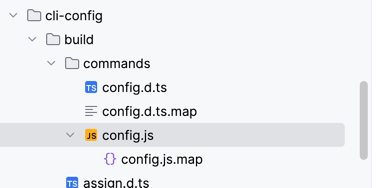

```javascript
"use strict";

Object.defineProperty(exports, "__esModule", {
    value: true
});
exports.default = void 0;

/**
 * 检查依赖项是否有效，至少应该一个有效的平台配置，例如：android，ios
 * @param config
 * @returns {boolean}
 */
function isValidRNDependency(config) {
    return Object.keys(config.platforms).filter(key => Boolean(config.platforms[key])).length !== 0;
}

function filterConfig(config) {
    //下面这个操作会涉及到属性值的访问，访问属性值时就会触发上面getter函数的执行，从而完善配置信息
    const filtered = {
        ...config
    };

    Object.keys(filtered.dependencies).forEach(item => {
        if (!isValidRNDependency(filtered.dependencies[item])) {
            //删除不符合条件的依赖
            delete filtered.dependencies[item];
        }
    });
    return filtered;
}

var _default = {
    name: 'config',
    description: 'Print CLI configuration',
    func: async (_argv, ctx) => {
        var filteredConfig = filterConfig(ctx);
        console.log(JSON.stringify(filteredConfig, null, 2))
    }
};
exports.default = _default;

//# sourceMappingURL=config.ts.map

```

可以看到，实际上config.js代码只做了一个操作，就是把不符合条件的依赖给过滤掉。这也就是为什么gradle中得到的依赖比config的实际结果少的原因。


下面我们看下最终经过config.js处理过后的结果
```json
{
  "root": "/Users/yuzhiqiang/workspace/RN/personal/RNProjectAnalysis",
  "reactNativePath": "/Users/yuzhiqiang/workspace/RN/personal/RNProjectAnalysis/node_modules/react-native",
  "reactNativeVersion": "0.73",
  "dependencies": {
    "react-native-device-info": {
      "root": "/Users/yuzhiqiang/workspace/RN/personal/RNProjectAnalysis/node_modules/react-native-device-info",
      "name": "react-native-device-info",
      "platforms": {
        "ios": {
          "podspecPath": "/Users/yuzhiqiang/workspace/RN/personal/RNProjectAnalysis/node_modules/react-native-device-info/RNDeviceInfo.podspec",
          "version": "10.12.0",
          "configurations": [],
          "scriptPhases": []
        },
        "android": {
          "sourceDir": "/Users/yuzhiqiang/workspace/RN/personal/RNProjectAnalysis/node_modules/react-native-device-info/android",
          "packageImportPath": "import com.learnium.RNDeviceInfo.RNDeviceInfo;",
          "packageInstance": "new RNDeviceInfo()",
          "buildTypes": [],
          "componentDescriptors": [],
          "cmakeListsPath": "/Users/yuzhiqiang/workspace/RN/personal/RNProjectAnalysis/node_modules/react-native-device-info/android/build/generated/source/codegen/jni/CMakeLists.txt"
        }
      }
    }
  },
  "commands": [
    {
      "name": "log-ios",
      "description": "starts iOS device syslog tail",
      "options": [
        {
          "name": "--interactive",
          "description": "Explicitly select simulator to tail logs from. By default it will tail logs from the first booted and available simulator."
        }
      ]
    },
    {
      "name": "run-ios",
      "description": "builds your app and starts it on iOS simulator",
      "examples": [
        {
          "desc": "Run on a different simulator, e.g. iPhone SE (2nd generation)",
          "cmd": "npx react-native run-ios --simulator \"iPhone SE (2nd generation)\""
        },
        {
          "desc": "Run on a connected device, e.g. Max's iPhone",
          "cmd": "npx react-native run-ios --device \"Max's iPhone\""
        },
        {
          "desc": "Run on the AppleTV simulator",
          "cmd": "npx react-native run-ios --simulator \"Apple TV\"  --scheme \"helloworld-tvOS\""
        }
      ],
      "options": [
        {
          "name": "--mode <string>",
          "description": "Explicitly set the scheme configuration to use. This option is case sensitive."
        },
        {
          "name": "--scheme <string>",
          "description": "Explicitly set Xcode scheme to use"
        },
        {
          "name": "--destination <string>",
          "description": "Explicitly extend destination e.g. \"arch=x86_64\""
        },
        {
          "name": "--verbose",
          "description": "Do not use xcbeautify or xcpretty even if installed"
        },
        {
          "name": "--xcconfig [string]",
          "description": "Explicitly set xcconfig to use"
        },
        {
          "name": "--buildFolder <string>",
          "description": "Location for iOS build artifacts. Corresponds to Xcode's \"-derivedDataPath\"."
        },
        {
          "name": "--extra-params <string>",
          "description": "Custom params that will be passed to xcodebuild command."
        },
        {
          "name": "--target <string>",
          "description": "Explicitly set Xcode target to use."
        },
        {
          "name": "--interactive",
          "description": "Explicitly select which scheme and configuration to use before running a build"
        },
        {
          "name": "--force-pods",
          "description": "Force CocoaPods installation"
        },
        {
          "name": "--no-packager",
          "description": "Do not launch packager while running the app"
        },
        {
          "name": "--port <number>",
          "default": 8081
        },
        {
          "name": "--terminal <string>",
          "description": "Launches the Metro Bundler in a new window using the specified terminal path."
        },
        {
          "name": "--binary-path <string>",
          "description": "Path relative to project root where pre-built .app binary lives."
        },
        {
          "name": "--list-devices",
          "description": "List all available iOS devices and simulators and let you choose one to run the app. "
        },
        {
          "name": "--simulator <string>",
          "description": "Explicitly set the simulator to use. Optionally set the iOS version between parentheses at the end to match an exact version: \"iPhone 15 (17.0)\""
        },
        {
          "name": "--device <string>",
          "description": "Explicitly set the device to use by name. The value is not required if you have a single device connected."
        },
        {
          "name": "--udid <string>",
          "description": "Explicitly set the device to use by UDID"
        }
      ]
    },
    {
      "name": "build-ios",
      "description": "builds your app for iOS platform",
      "examples": [
        {
          "desc": "Build the app for all iOS devices in Release mode",
          "cmd": "npx react-native build-ios --mode \"Release\""
        }
      ],
      "options": [
        {
          "name": "--mode <string>",
          "description": "Explicitly set the scheme configuration to use. This option is case sensitive."
        },
        {
          "name": "--scheme <string>",
          "description": "Explicitly set Xcode scheme to use"
        },
        {
          "name": "--destination <string>",
          "description": "Explicitly extend destination e.g. \"arch=x86_64\""
        },
        {
          "name": "--verbose",
          "description": "Do not use xcbeautify or xcpretty even if installed"
        },
        {
          "name": "--xcconfig [string]",
          "description": "Explicitly set xcconfig to use"
        },
        {
          "name": "--buildFolder <string>",
          "description": "Location for iOS build artifacts. Corresponds to Xcode's \"-derivedDataPath\"."
        },
        {
          "name": "--extra-params <string>",
          "description": "Custom params that will be passed to xcodebuild command."
        },
        {
          "name": "--target <string>",
          "description": "Explicitly set Xcode target to use."
        },
        {
          "name": "--interactive",
          "description": "Explicitly select which scheme and configuration to use before running a build"
        },
        {
          "name": "--force-pods",
          "description": "Force CocoaPods installation"
        }
      ]
    },
    {
      "name": "log-android",
      "description": "starts logkitty"
    },
    {
      "name": "run-android",
      "description": "builds your app and starts it on a connected Android emulator or device",
      "options": [
        {
          "name": "--mode <string>",
          "description": "Specify your app's build variant"
        },
        {
          "name": "--tasks <list>",
          "description": "Run custom Gradle tasks. By default it's \"assembleDebug\". Will override passed mode and variant arguments."
        },
        {
          "name": "--active-arch-only",
          "description": "Build native libraries only for the current device architecture for debug builds.",
          "default": false
        },
        {
          "name": "--extra-params <string>",
          "description": "Custom params passed to gradle build command"
        },
        {
          "name": "--interactive",
          "description": "Explicitly select build type and flavour to use before running a build"
        },
        {
          "name": "--no-packager",
          "description": "Do not launch packager while running the app"
        },
        {
          "name": "--port <number>",
          "default": 8081
        },
        {
          "name": "--terminal <string>",
          "description": "Launches the Metro Bundler in a new window using the specified terminal path."
        },
        {
          "name": "--appId <string>",
          "description": "Specify an applicationId to launch after build. If not specified, `package` from AndroidManifest.xml will be used.",
          "default": ""
        },
        {
          "name": "--appIdSuffix <string>",
          "description": "Specify an applicationIdSuffix to launch after build.",
          "default": ""
        },
        {
          "name": "--main-activity <string>",
          "description": "Name of the activity to start"
        },
        {
          "name": "--deviceId <string>",
          "description": "builds your app and starts it on a specific device/simulator with the given device id (listed by running \"adb devices\" on the command line)."
        },
        {
          "name": "--list-devices",
          "description": "Lists all available Android devices and simulators and let you choose one to run the app",
          "default": false
        },
        {
          "name": "--binary-path <string>",
          "description": "Path relative to project root where pre-built .apk binary lives."
        },
        {
          "name": "--user <number>",
          "description": "Id of the User Profile you want to install the app on."
        }
      ]
    },
    {
      "name": "build-android",
      "description": "builds your app",
      "options": [
        {
          "name": "--mode <string>",
          "description": "Specify your app's build variant"
        },
        {
          "name": "--tasks <list>",
          "description": "Run custom Gradle tasks. By default it's \"assembleDebug\". Will override passed mode and variant arguments."
        },
        {
          "name": "--active-arch-only",
          "description": "Build native libraries only for the current device architecture for debug builds.",
          "default": false
        },
        {
          "name": "--extra-params <string>",
          "description": "Custom params passed to gradle build command"
        },
        {
          "name": "--interactive",
          "description": "Explicitly select build type and flavour to use before running a build"
        }
      ]
    },
    {
      "name": "bundle",
      "description": "Build the bundle for the provided JavaScript entry file.",
      "options": [
        {
          "name": "--entry-file <path>",
          "description": "Path to the root JS file, either absolute or relative to JS root"
        },
        {
          "name": "--platform <string>",
          "description": "Either \"ios\" or \"android\"",
          "default": "ios"
        },
        {
          "name": "--transformer <string>",
          "description": "Specify a custom transformer to be used"
        },
        {
          "name": "--dev [boolean]",
          "description": "If false, warnings are disabled and the bundle is minified",
          "default": true
        },
        {
          "name": "--minify [boolean]",
          "description": "Allows overriding whether bundle is minified. This defaults to false if dev is true, and true if dev is false. Disabling minification can be useful for speeding up production builds for testing purposes."
        },
        {
          "name": "--bundle-output <string>",
          "description": "File name where to store the resulting bundle, ex. /tmp/groups.bundle"
        },
        {
          "name": "--bundle-encoding <string>",
          "description": "Encoding the bundle should be written in (https://nodejs.org/api/buffer.html#buffer_buffer).",
          "default": "utf8"
        },
        {
          "name": "--max-workers <number>",
          "description": "Specifies the maximum number of workers the worker-pool will spawn for transforming files. This defaults to the number of the cores available on your machine."
        },
        {
          "name": "--sourcemap-output <string>",
          "description": "File name where to store the sourcemap file for resulting bundle, ex. /tmp/groups.map"
        },
        {
          "name": "--sourcemap-sources-root <string>",
          "description": "Path to make sourcemap's sources entries relative to, ex. /root/dir"
        },
        {
          "name": "--sourcemap-use-absolute-path",
          "description": "Report SourceMapURL using its full path",
          "default": false
        },
        {
          "name": "--assets-dest <string>",
          "description": "Directory name where to store assets referenced in the bundle"
        },
        {
          "name": "--unstable-transform-profile <string>",
          "description": "Experimental, transform JS for a specific JS engine. Currently supported: hermes, hermes-canary, default",
          "default": "default"
        },
        {
          "name": "--asset-catalog-dest [string]",
          "description": "Path where to create an iOS Asset Catalog for images"
        },
        {
          "name": "--reset-cache",
          "description": "Removes cached files",
          "default": false
        },
        {
          "name": "--read-global-cache",
          "description": "Try to fetch transformed JS code from the global cache, if configured.",
          "default": false
        },
        {
          "name": "--config <string>",
          "description": "Path to the CLI configuration file"
        }
      ]
    },
    {
      "name": "ram-bundle",
      "description": "Build the RAM bundle for the provided JavaScript entry file. See https://reactnative.dev/docs/ram-bundles-inline-requires.",
      "options": [
        {
          "name": "--entry-file <path>",
          "description": "Path to the root JS file, either absolute or relative to JS root"
        },
        {
          "name": "--platform <string>",
          "description": "Either \"ios\" or \"android\"",
          "default": "ios"
        },
        {
          "name": "--transformer <string>",
          "description": "Specify a custom transformer to be used"
        },
        {
          "name": "--dev [boolean]",
          "description": "If false, warnings are disabled and the bundle is minified",
          "default": true
        },
        {
          "name": "--minify [boolean]",
          "description": "Allows overriding whether bundle is minified. This defaults to false if dev is true, and true if dev is false. Disabling minification can be useful for speeding up production builds for testing purposes."
        },
        {
          "name": "--bundle-output <string>",
          "description": "File name where to store the resulting bundle, ex. /tmp/groups.bundle"
        },
        {
          "name": "--bundle-encoding <string>",
          "description": "Encoding the bundle should be written in (https://nodejs.org/api/buffer.html#buffer_buffer).",
          "default": "utf8"
        },
        {
          "name": "--max-workers <number>",
          "description": "Specifies the maximum number of workers the worker-pool will spawn for transforming files. This defaults to the number of the cores available on your machine."
        },
        {
          "name": "--sourcemap-output <string>",
          "description": "File name where to store the sourcemap file for resulting bundle, ex. /tmp/groups.map"
        },
        {
          "name": "--sourcemap-sources-root <string>",
          "description": "Path to make sourcemap's sources entries relative to, ex. /root/dir"
        },
        {
          "name": "--sourcemap-use-absolute-path",
          "description": "Report SourceMapURL using its full path",
          "default": false
        },
        {
          "name": "--assets-dest <string>",
          "description": "Directory name where to store assets referenced in the bundle"
        },
        {
          "name": "--unstable-transform-profile <string>",
          "description": "Experimental, transform JS for a specific JS engine. Currently supported: hermes, hermes-canary, default",
          "default": "default"
        },
        {
          "name": "--asset-catalog-dest [string]",
          "description": "Path where to create an iOS Asset Catalog for images"
        },
        {
          "name": "--reset-cache",
          "description": "Removes cached files",
          "default": false
        },
        {
          "name": "--read-global-cache",
          "description": "Try to fetch transformed JS code from the global cache, if configured.",
          "default": false
        },
        {
          "name": "--config <string>",
          "description": "Path to the CLI configuration file"
        },
        {
          "name": "--indexed-ram-bundle",
          "description": "Force the \"Indexed RAM\" bundle file format, even when building for android",
          "default": false
        }
      ]
    },
    {
      "name": "start",
      "description": "Start the React Native development server.",
      "options": [
        {
          "name": "--port <number>"
        },
        {
          "name": "--host <string>",
          "default": ""
        },
        {
          "name": "--projectRoot <path>",
          "description": "Path to a custom project root"
        },
        {
          "name": "--watchFolders <list>",
          "description": "Specify any additional folders to be added to the watch list"
        },
        {
          "name": "--assetPlugins <list>",
          "description": "Specify any additional asset plugins to be used by the packager by full filepath"
        },
        {
          "name": "--sourceExts <list>",
          "description": "Specify any additional source extensions to be used by the packager"
        },
        {
          "name": "--max-workers <number>",
          "description": "Specifies the maximum number of workers the worker-pool will spawn for transforming files. This defaults to the number of the cores available on your machine."
        },
        {
          "name": "--transformer <string>",
          "description": "Specify a custom transformer to be used"
        },
        {
          "name": "--reset-cache, --resetCache",
          "description": "Removes cached files"
        },
        {
          "name": "--custom-log-reporter-path, --customLogReporterPath <string>",
          "description": "Path to a JavaScript file that exports a log reporter as a replacement for TerminalReporter"
        },
        {
          "name": "--https",
          "description": "Enables https connections to the server"
        },
        {
          "name": "--key <path>",
          "description": "Path to custom SSL key"
        },
        {
          "name": "--cert <path>",
          "description": "Path to custom SSL cert"
        },
        {
          "name": "--config <string>",
          "description": "Path to the CLI configuration file"
        },
        {
          "name": "--no-interactive",
          "description": "Disables interactive mode"
        },
        {
          "name": "--experimental-debugger",
          "description": "[Experimental] Enable the new debugger experience and 'j' to debug. This enables the new frontend experience only: connection reliability and some basic features are unstable in this release."
        }
      ]
    }
  ],
  "healthChecks": [],
  "platforms": {
    "ios": {},
    "android": {}
  },
  "project": {
    "ios": {
      "sourceDir": "/Users/yuzhiqiang/workspace/RN/personal/RNProjectAnalysis/ios",
      "xcodeProject": {
        "name": "MyProject.xcodeproj",
        "isWorkspace": false
      }
    },
    "android": {
      "sourceDir": "/Users/yuzhiqiang/workspace/RN/personal/RNProjectAnalysis/android",
      "appName": "app",
      "packageName": "com.yzq.rn_project_analysis",
      "applicationId": "com.yzq.rn_project_analysis",
      "mainActivity": ".MainActivity"
    }
  }
}

```

到这里，cli-config命令的执行过程就分析完了。
总结一下cli整个的运行流程
1.入口是cli目录下的bin.js,最终调用了同级目录下index.jsz中的`setupAndRun`方法，其中首先会调用cli-config中的loadConfig用于初步获取项目配置信息
2.接着将拿到的项目配置信息中的commands和项目预定义好的command合并，然后注册命令
3.最后执行命令，例如执行config命令时，会调用cli-config中commands目录下config.js文件中的代码
4.执行filterConfig对获得的配置信息进行获取，过滤处理，最终返回


----


### 总结

到这里算是把RN项目的目录结构，gradle插件以及gradle脚本的作用还有前端cli的执行过程都分析了一遍。这样我们就对RN项目的构建过程有了一个大概的了解。
下面我们总结以下他们分别的作用

**react-native-gradle-plugin**
- 做一些编译环境的检查
- 创建了一些配置项，用于在app项目和库项目之间共享配置
- 统一替换项目中以及依赖的三方插件的react-native相关的依赖，并确保版本一致
- 配置任务，包括运行看打包，生成代码等任务

**native-modules.gradle**
- 通过前端cli的config命令获取到需要的配置信息
- 根据config命令返回的配置信息，在settings.gradle中添加需要编译的第三方库
- 在app模块中添加需要编译的第三方库的依赖，并通过代码模版生成PackageList.java文件以及新架构所需的jin相关文件

**前端cli**
- 提供一系列的命令，例如config，start，run-android等等
- 通过执行config命令可以获取到项目的配置信息，过滤掉不符合条件的依赖，然后返回给native-modules.gradle 使用

到这里，我们可以回答一开始的问题，**为什么我们 只需要一个`yarn add react-native-device-info`就能让RN项目使用原生的功能，这是怎么做到的呢？**

回答如下：
1. 当我们通过 `yarn add react-native-device-info` 安装了一个第三方库时，会在package.json中添加一个依赖，然后执行 yarn install 安装依赖。
2. 后续触发编译项目的操作时，android会由gradle插件以及native-modules.gradle 脚本做一系列的处理
3. native-modules.gradle 会根据package.json中的依赖，通过调用前端cli的config命令获取到需要的配置信息
4. 前端cli的config命令会根据项目的配置信息，过滤掉不符合条件的依赖，然后返回给native-modules.gradle
5. native-modules.gradle 会根据config命令返回的配置信息，在settings.gradle中添加需要编译的第三方库
6. 同时在app模块中添加需要编译的第三方库的依赖，并通过代码模版生成PackageList.java文件以及新架构所需的jin相关文件
7. gradle插件则负责做一些编译环境的检查，对RN依赖进行统一处理（替换以及确保版本一致）以及注册一些task


这样就完成了整个RN项目的编译和构建流程了。可以看到，整个流程中，前端cli的config命令起到了一个关键的作用，他是整个流程的核心。
       
        

---


               
          
