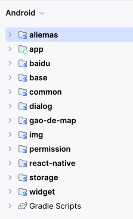
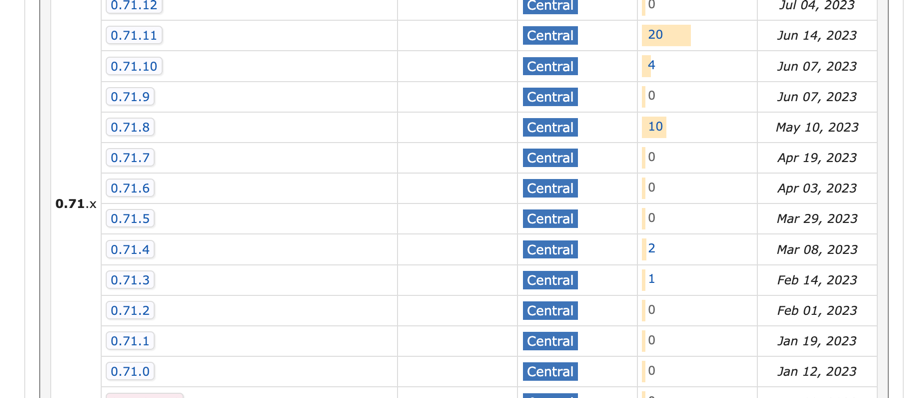
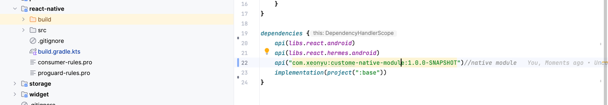

# 传统RN项目对比

分析完毕RN默认项目后，下面，我们来看一下如何在已有项目中即成RN。

官方给了一个[详细的文档](https://reactnative.cn/docs/integration-with-existing-apps/)，也比较简单。
这里就不再把文档中的内容重复了，直接来看一下跟默认项目的区别。

**相同之处**

- **项目结构**：两者项目结构基本相同，主要以RN的项目结构为核心，其中Android部分作为子目录集成于RN项目中。
- **组织逻辑**：都需要集成RN提供的插件以及native_modules脚本，来对项目进行组织和构建。

**不同之处**

- **UI处理方式**：
    - 默认项目：纯RN项目中，视图渲染是在Activity级别进行，所有视图均由RN渲染。
    - 集成到已有项目：视图的渲染粒度更为灵活，可以是Activity级别，也可以是Fragment或View级别。开发者可以根据具体业务需求，自由选择由RN还是原生代码来渲染视图，提供更加定制化的用户体验。
- **定制化能力**：
    - 默认项目：定制化能力相对有限，主要依赖于RN官方提供的插件和组件。
    - 集成到已有项目：通过将RN作为组件集成，有更高的灵活性和定制化空间。可以根据业务需求开发专属的RN插件，还能在项目中灵活地利用RN的强大功能，从而实现更丰富和个性化的应用体验。

也就是说，两种方式在代码组织上并无本质上的区别，仅仅是在UI处理方式和定制化能力上有所不同。

# RN项目搭建思考

### 找出核心点

对于RN官方给到我们的两种项目结构，实际上都是以RN为核心，然后在此基础上进行扩展。这种方式对于新项目来说，是非常合适的，因为RN的优势在于跨平台，可以快速开发出一个具有良好用户体验的应用。

在实际的开发中，更多的是在已有项目中引入RN，RN作为原生项目的一部分来进行混合开发。
对于已有项目来说，我们需要考虑的是如何能够更简单的引入RN，尽量小的改动项目的目录结构以及构建模式，毕竟对于已存在的项目来说，无论是目录结构的迁移还是构建模式的改变，都是一个非常大的工程。
这就需要我们在项目集成时，对RN的定制化能力有一定的了解，以便更好地应用到项目中。

在原生Android开发中，如果要新增一个模块或者引入一个组件时，都是把模块或者组件作为一个独立的模块引入到项目中，然后在项目中进行调用。
也就是说，模块或者组件是Android项目中独立的一部分。

例如下面这种组织结构：



项目仍然是一个标准的Android项目，React Native作为项目中的一个模块或者组件存在，而不是把整个项目都变成一个RN结构的项目。

要实现这种方式，实际上也比较简单，在前面的文章中，我们已经对RN的构建流程搞得比较清楚了。下面主要就是结合官方的在已有项目中集成RN的文档，稍作改造，集成到项目中即可。

参考在已有项目中集成RN的文档，相较于传统的Android项目，核心的点在于 **React Native 相关的依赖需要从 node_modules 中引入**
，这样才能在项目中使用RN的功能，主要包括：

- React Native 源码
- React Native 插件：react-native-gradle-plugin
- React Native 脚本：native_modules.gradle
- React Native 中需要用到的原生模块：native module

其中，React Native源码和原生模块的引入是必须要处理的，因为他们是RN的核心部分。
而 react-native-gradle-plugin 和 native_modules.gradle 这两个插件是可选的，可以根据项目的实际情况来决定是否引入。

### 处理 React Native 的依赖

这里分两种情况

1. 直接引入 Maven 仓库中的 React Native 依赖
2. 自己编译 React Native 源码，打出 AAR 包引入

**直接从 Maven 仓库中引入 React Native 依赖**

从React Native 0.71.0版本开始，React Native提供了Maven仓库，可以直接从Maven仓库中引入React Native的依赖。



注意，这里的依赖是指React Native的Android部分，也就是react-android和hermes-android。

```groovy
// https://mvnrepository.com/artifact/com.facebook.react/react-android
implementation("com.facebook.react:react-android:0.71.0")
implementation("com.facebook.react:hermes-android:0.71.0")

```

**自己编译 React Native 源码，打出 AAR 包引入**
在0.71.0版本之前，React Native没有提供Maven仓库，所以只能通过源码编译的方式来引入React
Native的依赖，或者使用传统的直接从nodu_modules中引入源码的方式。

在日常开发中，React Native源码本身存在一些bug或者不符合自身业务需求的地方，此时，我们也需要对源码进行修改。

**优点：** 可以根据自己的需求来修改源码，无需依赖于官方的发布版本，也可以更好地适应项目的需求，自由度相对更高

**缺点：** 需要自己维护这个AAR包，当React Native官方发布新版本时，需要自己手动同步源码，然后重新编译打包。
也可以采用字节码插桩的方式，直接在项目中引入React Native的源码，然后针对需要修改的地方进行修改，这样可以减少维护成本。

不管是需要修改源码还是针对低版本的React Native，自行编译源码都是很有必要的操作。
所以，个人还是推荐自行编译源码的方式，这样可以更好地适应项目的需求，也可以更好地理解React Native的构建过程。

### 处理 native module 的依赖

在Android中对于React Native中的Native Module而言，本质上就是一个Android Library Module，我们可以把Native
Module作为一个独立的模块引入到项目中。

这里也有两种做法

1. 采用传统的方式，直接把Native Module作为一个独立的模块引入到项目中，也就是直接依赖源码。
2. 自己编译Native Module，打出AAR包引入

关于源码依赖的方式，管理起来就相对复杂一些，为了方便的管理这些native module，可以针对package.json文件进行处理，把依赖的native
module中的android部分的代码安装到Android项目中。通过project的方式依赖进项目，这样相当于把native module作为一个独立的模块引入到项目中。

个人更加推荐自己编译Native Module，打出AAR包引入的方式，自己开发的Native Module不用说，本质上就是一个Android Library
Module，所以可以直接打出AAR传到maven私有仓库中通过远程依赖的方式实现。
对于三方的Native Module，也可以把源码拉下来自行编译，打出AAR通过远程依赖的方式引入到项目中。

### 处理 React Native 插件和脚本

上面也说到了，react-native-gradle-plugin 和 native_modules.gradle 这两个插件是可选的，他们的作用主要是帮助我们更好地管理React
Native的构建过程，方便我们在项目中引入React Native的功能。
个人的建议是根据自身的需求，对插件和脚本进行定制化的来引入，也方便于App项目直接跟React Native源码联调时不至于依赖出问题。

# 示例

按照上面的思路，来看一下如何在已有项目中引入RN。

例如，我们有一个已有的Android项目，想集成React Native。
我们可以新建一个RN模块， 该模块管理了众多的Native Module，以及对React Native进行封装方便壳子工程使用。同时，也可以发布到远端作为组件使用。

如下示例：



该模块集成管理了React Native以及native module的依赖，壳子工程则只需要依赖该模块即可。

然后就能在代码中使用RN的功能了，例如：

```kotlin
    override fun createReactInstanceManager(): ReactInstanceManager {
        return ReactInstanceManager.builder()
            //设置Application上下文；
            .setApplication(AppManager.application)
            //添加package，package内部包含了多个Native Module；
            .addPackage(MainReactPackage())//默认的Native Module；
            .addPackage(CustomeNativeModulePackage())//自定义的Native Module；
            //JS 异常回调处理实现；
            .setRedBoxHandler(BaseJsExecptionHandler())
            .setCurrentActivity(this)
            .setBundleAssetName("rn/index.android.bundle")//打包时放在assets目录下的JS bundle包的名字，加载内置bundle时使用；
            .setJSMainModulePath("index")//入口文件名字，即index.js；
            .setJavaScriptExecutorFactory(HermesExecutorFactory())
            .setUseDeveloperSupport(BuildConfig.DEBUG)//开发者支持，开发模式下开启；
            .setInitialLifecycleState(LifecycleState.RESUMED)//设置初始生命周期状态，这里设置为resume即可；
            .build()


    }
```


相较于传统的模式，这种结构更加清晰，也更符合Android项目的组织方式。同时也是改动最小的一种方式，对于已有项目来说，是一个比较好的选择。


# 总结

到这里，RN的默认项目结构和构建的分析，以及对如何更加贴近日常开发的RN项目搭建的思考就结束了，希望能给到各位大佬一些启发。


